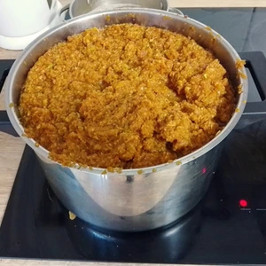

Als jemand, welch die meiste Zeit des Lebens in Hessen aufwuchs, verspüre ich gelegentlich die Lust auf Ebbelwei. Da es diesen nicht überall zu erwerben gibt, oder wenn es hoch kommt, nur Cider, war ich gewillt selber welchen zubereiten.
Dabei ist die Herstellung nicht kompliziert. Es nimmt Zeit in Anspruch, bis wir den ersten Trunk genießen können.
<!-- more -->

Für die Herstellung brauchen wir tatsächlich nicht viel, aber nicht im jeden Haushalt vorhanden sind.

# Zutaten
* 10-12 KG Reife Äpfel
* Weinhefe
  * 3ml Flüssighefe (z.b. Arauner)
  * 1g Trockenhefe (z.b. Kizinger)
* (Optional) 0,5 KG Zucker

Dazu brauchen wir noch folgende Werkzeuge
* 5 L Gärballon
* Gärverschluss (mit Gärröhrchen)

* Entsafter oder
* Reibe oder
* Pürierstab
* Mulltuch oder Nussmilchbeutel

Die Äpfel werden entkernt und die Stiele entfernt, die Schale benötigen wir noch. 
Die Äpfel können nun durch den Entsafter oder durch die Weinpresse. Solltest du sowas nicht besitzen, so wie ich, kannst du die Äpfel grob schneiden und dann mit einem Pürierstab klein häckseln. Solltest du auch dieses nicht haben, bleibt nur noch die Reibe übrig. In den letzten beiden Fällen müssen die Apfelreste durch ein Mulltuch bzw. einen Nussmilchbeutel gepresst werden, damit wir soviel Saft wie möglich erhalten.

Der Saft kommt nun in den Gärballon. Dieser darf nicht bis oben voll gefüllt werden, da noch Platz für das sich bildende Gas benötigt wird. Wer etwas mehr Alkohol haben will, kann zu dem Apfelsaft noch einen halben Kilo Zucker dazu geben und verrühren. Zum Schluss kommt die Hefe zum Saft und der Gärballon wird mit dem Verschluss verschlossen, sodass keine Luft hineinkommt, aber Gase entweichen können. 

Der Gärballon sollte in einen kühlen Raum abgestellt werden, welcher 21 Grad nicht übersteigen wird.
Nun heißt es warten, denn der Zucker im Saft muss gären. Dies kann bis zu vier Wochen dauern. Dabei ist es zu empfehlen, täglich den Gärballon zu schwenken. Sobald keine Bläschen mehr im Röhrchen zu vernehmen sind ist der Apfelwein fertig. 

Zum Abfüllen und Filtern des Weines stellen wir den Gärballon höher als das Zielgefäß. Mit einem Schlauch saugen wir kurz an und lassen den Wein in die Flaschen abziehen. Achtet darauf, mit dem Schlauch nicht an den Bodensatz kommt.  

Vielleicht habt ihr euch gefragt, was mit den entstehenden Resten hergestellt werden kann. In meinem Fall mischte ich es mit Hafermehl und machte daraus [Kekse](articles/apfelzimt-haferplaetzchen-2023-12-20/).
  
