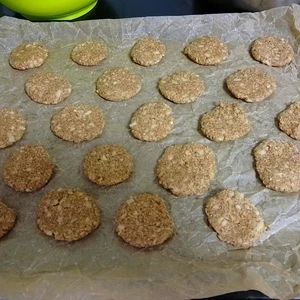

Als Abwandlung zum Peanutbutter-Oat-Cookie Rezept, kann auch ein Apfel mit Zimt genommen werden. 

<!-- more -->
# Zutaten
* 120g Haferflocken
* 100g Margarine
* 1 Apfel
* 60g Rohrzucker
* 1EL Zimt
* 50g Dinkelmehl
* Prise Salz

Wie bereits im Rezept für die Peanut-Oat-Cookies, müssen die Haferflocken zermahlen werden und mit Dinkelmehl, Rohrzucker, Zimt und Salz vermengt werden.
Den Apfel schälen wir und raspeln diesen zu unseren Zutaten hinzu. Darüber streuen wir das Zimt (alternativ kann auch ein Orangenpulver genommen werden) und wer will, kann noch ein Esslöffel [Honig](/articles/loewenzahn-sirup-2019-04-22/) hinzugeben. Im Gegensatz zum Peanut-Oat-Cookies Rezept brauchen wir durch den Apfel keine Hafermilch.
Zum Schluss wird die Margarine in kleinen Portionen hinzugegeben, damit diese leichter verknetet werden kann, sowie ein Esslöffel Hafermilch.

Nun wird alles zu einer Masse verknetet und kleine Kugel geformt, welche auf ein Backblech mit Backpapier gelegt und platt gedrückt werden. Je dicker die Kekse sind, umso länger brauchen diese zum Backen. Wenn diese wiederum zu dünn sind, verbrennen diese schneller.

Danach wird das Backblech für zwanzig Minuten in ein auf 200 Grad (Ober- und Unterhitze) vorgeheizten Ofen geschoben. Die Kekse härten beim Abkühlen aus, also nicht wundern, wenn diese nach zwanzig Minuten noch weich sein sollten.

