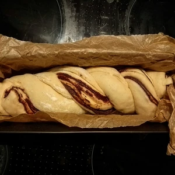
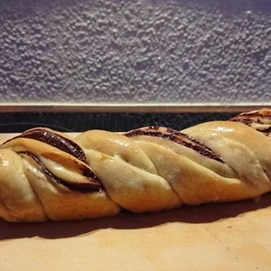
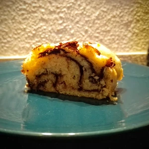
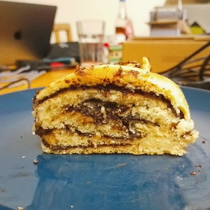

Gestern habe ich in meinem Hackspace die Küche wieder belagert und Foodhacking betrieben. 
Ich habe mich gefragt, wie würde ich einen Osteuropäischen süßen Hefekuchen zaubere und habe deshalb experimentiert. 
Ich entschloss mich für eine jüdische Variante und wie es sich für mich gehört nur mit ausschließlich veganen Zutaten.

<!-- more -->
# Zutaten
* 335g Weizenmehl Typ 405
* 150ml lauwarme [Hafermilch](/articles/hafermilch-2022-01-29/)
* 4g Trockenhefe
* Prise Salz
* 8g Vanillezucker
* 1 El [Honig](/articles/loewenzahn-sirup-2019-04-22/)
* 5 EL neutrales Öl
* 80g Schokolade
* 15g Kakaopulver
* 3 EL [Honig](/articles/loewenzahn-sirup-2019-04-22/) zum Bestreichen

Die [Hafermilch](/articles/hafermilch-2022-01-29/) muss lauwarm sein, damit die Hefe, welche wir hinzugeben, sich darin entfalten und auflösen kann. 
Dazugeben wir einen Esslöffel [Honig](/articles/loewenzahn-sirup-2019-04-22/) hinzu. Alternativ einen Teelöffel Rohrzucker. 
Dies verrühren wir und lassen die Hefe etwas arbeiten. Währenddessen vermengen wir Mehl, Salz und Vanillezucker. 
Sobald die Hefe in der [Hafermilch](/articles/hafermilch-2022-01-29/) anfängt zu schäumen, kippen wir drei Esslöffel Öl in den Teig und gießen dann die [Hafermilch](/articles/hafermilch-2022-01-29/) darüber. 
Das ganze wird nun geknetet, bis wir einen gleiten Teig erhalten und nichts mehr an der Schüssel kleben bleibt. 
Legt einen Deckel auf die Schüssel und stellt den Teig für eine Stunde an einen warmen Ort, damit der Teig gehen kann. 

Danach kann dieser auf einer bemehlten Oberfläche dünn ausgerollt werden, sodass dieser in eine lange Backform passt. 
Jetzt können wir die Schokolade in einem Wasserbad schmelzen und mit dem Kakaopulver vermischen. 
Bestreicht jetzt den ausgerollten Teig mit der Schokolade und rollt diese der Länge nach zusammen. 
Die Rolle wird in der Mitte der lange nach aufgeschnitten und zu einem Zopf geflochten. 
Überkreuzt dabei die Hälften über die ganze Länge nach und drückt die Enden zusammen. 
Den Zopf könnt ihr jetzt in eine mit Backpapier ausgekleidete Backform legen und für weitere 30 Minuten, zugedeckt gehen lassen. 
Währenddessen wird der Ofen auf 180 Grad Ober- und Unterhitze vorgeheizt. 

Jetzt kann der Zopf für 35 Minuten in den Ofen geschoben werden. 
Ist der Zopf fertig gebacken, wird dieser sofort mit flüssigem [Honig](/articles/loewenzahn-sirup-2019-04-22/) bestrichen und lassen diesen auskühlen sowie trocknen.

|||
:----:|:----:
||
