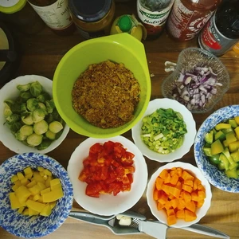
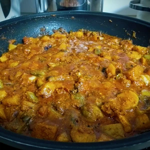

Wir gehen mittlerweile auf den Winter zu und die Speisen wandeln sich zu heißen Suppen und Eintöpfen. Der Vorteil davon ist, dass größere Mengen produziert werden können und eins davon länger etwas hat.
Dieses Rezept kann nach Belieben variiert und verändert werden, da ihr nicht auf die Gemüsesorten festgesetzt seid.

<!-- more -->

# Zutaten
* 200g veganes Hack (Gekauftes, [Okara](/), [Haferhack](/))
* 200g Kartoffel
* 150g Paprika Grün
* 200g Tomaten
* 200g Rosenkohl
* 100g Lauch
* 1 Möhre
* 1 Zwiebel
* 2 Knoblauchzehen
* 200g Kohlrabi
* 1 TL Rohrzucker
* Paprika Pulver
* Salz
* Pfeffer
* 400ml Gemüsebrühe
* 1 EL Tomatenmark
* veganer Schmand oder Creme Fresh
* Öl oder Margarine zum Anbraten

**Hinweis**: Wenn ihr weniger oder mehr Gemüse in hinzugebt, wird auch entsprechend weniger oder mehr Brühe benötigt. 

Das Gemüse wird gewaschen, geschält und gewürfelt. Dabei werden die Zwiebel klein gehackt. Den Rosenkohl habe ich den Strunk abgeschnitten und halbiert. Die Schale habe des Gemüses habe ich in einem Topf mit Wasser gekocht, um eine Gemüsebrühe zu erhalten.
Nun wird Öl oder Margarine in einem großen Topf oder in einer Wokpfanne auf großer Flamme erhitzt, worin wir unser Hack anbraten können. Sobald unser Hack Farbe bekommen hat, können wir die Zwiebel dazugeben und mit dem Rohrzucker bestreuen. Löscht alles der Gemüsebrühe ab und gibt die Tomaten hinzu. Jetzt folgt der Lauch, die Kartoffeln, Paprika, die Möhre, der Kohlrabi und der Rosenkohl. Zum Schluss kommt noch der Esslöffel Tomatenmark mit dem gepressten Knoblauch in den Topf.

Rührt alles ordentlich durch und stellt den Herd auf eine mittlere Hitze herunter. Jetzt kann entsprechend mit Salz, Pfeffer und Paprikapulver gewürzt werden. Legt einen Deckel auf den Topf und lasst das ganze für mindestens 40 Minuten kochen. Sollte der Eintopf zu dünn sein, könnt ihr weitere Zehn Minuten ohne Deckel köcheln lassen.

Nachdem portionieren, kann mit einem Klecks veganem Schmand oder Creme Fresh der Eintopf garniert werden.

**Wer es schärfer mag** Ich für meinen Teil, hatte beim Hackanbraten noch Chilis hinzugegeben und mit etwas Schärfe nachgeholfen. 
