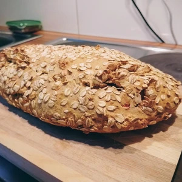

Neulich war ich mit einer Gruppe unterwegs und beim gemeinsamen Grillen ist es passiert, dass mein veganes Tiefkühlbaguette mit der auslaufenden nicht-veganen Butter kontaminiert wurde. Da aber im Haus alles vorhanden war, um schnell ein herzhaftes Brot zu backen, wurde ich erfinderisch.

<!-- more -->

# Zutaten

* 300 Gramm Mehl
* 1 Teelöffel Backpulver
* 3 Teelöffel Gewürzmischung aus Thymian, Knoblauch, Rosmarin und (Kreuz)Kümmel
* 1 Teelöffel Salz
* 1 Esslöffel [Honigersatz](/articles/loewenzahn-sirup-2019-04-22/) oder Zucker
* 160 Mililiter Bier nach Wahl
* 1 EL Margarine (zum Schluss auf den Teig geben)

Wir heizen den Backofen auf 180 Grad Ober- und Unterhitze vor und vermischen währenddessen Mehl, Backpulver, die Süße und Gewürze. In die Mitte des Teiges machen wir eine kleine Mulde und streuen das Salz an den Rand der Schüssel. Dann gießen wir langsam das Bier in die Mulde und verkneten alle Zutaten zu einem Teig, den wir in eine eingefettete Backform geben. Nun können wir die Margarine in einem Topf schmelzen, aber nicht verbrennen lassen, und damit die Oberseite des Teigs bestreichen. Zumschluss kommt das Brot für ca. 60 Minuten in den Ofen.

------
# Paprikabrot Variante

Nach diesem Rezept habe ich neulich ein leckeres Paprikabrot in der Werkswohnung meines Erwerbsarbeitskraftnehmers zubereitet. Das hat mich so positiv beeindruckt, dass ich die Abwandlung als Rezept aufschreiben musste.

# Zutaten

* 500g Weizenmehl Typ 405
* 2 Teelöffel Backpulver
* 1 Teelöffel Salz
* 2 Esslöffel Zucker
* 3 Teelöffel Mischung aus Anis, Kümmel und Fenchel
* 0,33l Bier nach Wahl
* 135g [Paprika-Aufstrich](/articles/paprika-aufstrich-2023-02-04/)
* Haferflocken

Wie beim Basisrezept wird der Backofen auf 180 Grad Ober- und Unterhitze vorgeheizt, während Mehl, Backpulver, Salz, Zucker und Brotgewürz vermischt werden. Dann gießen wir langsam das Bier dazu und kneten den Teig 10 Minuten lang. Danach geben wir den [Paprika-Aufstrich](/articles/paprika-aufstrich-2023-02-04/) hinzu und kneten den Teig nochmals 10 Minuten.
Auf ein Backblech legen wir Backpapier und bestreuen dieses großflächig mit Haferflocken, bevor wir den noch nicht festen Teig darauf legen und ebenfalls mit Haferflocken bestreuen. Dieser Vorgang ist etwas klebrig und umständlich, aber ohne Backform kann sich das Brot gut entfalten, wird luftig und bekommt eine zarte Kruste.
Die Backzeit beträgt 60 Minuten.
