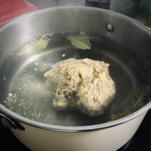

>  „Im Kessel wurde Bigos gekocht. Es ist schwer in Worte zu fassen. Der Geschmack so merkwürdig, die Farbe und der Geruch so wunderbar: Worte sind nur ein Summen und die Reime Zufall; aber den Inhalt wird nur der Magen verstehen.“
 
– Adam Mickiewicz: Pan Tadeusz
 
Weiter geht es mit der traditionellen osteuropäischen Küche, welche ververganisiert wurde. Dieses mal geht es um ein polnisches Nationalgericht, welches bei uns in der Familie zur kalten Jahreszeit zubereitet wird. 
<!-- more -->

Dabei wird ein großer Topf genommen, da der Bigos über eine längere Zeit die Bäuche vollstopfen soll. Dieses Gericht ist nicht nur in Polen bekannt, auch in der West-Ukraine (Бігос - Bigos), Belarus (Бігас Bigas) und auch in Litauen (Bigoss) wird dieses zubereitet.

Bei Bigos handelt es sich um einen Krauteintopf mit verschiedenen Fleisch und Wurstsorten, Sauerkraut und Weißkohl, welcher Süß-Sauer mundet. Ein festes Rezept existiert nicht, da dieses von Region zu Region variiert und auch von Familie zu Familie Abweichungen entstehen. So auch bei uns. Während meine Familie Wurst und Fleisch benutzt, wird von mir Seitanbraten, Tofu und veganer Speck für die Zubereitung genutzt. Optional kann man hierzu auch Pilze hinzugeben, welche bei dem Rezept meiner Familie nicht vorkommen. 

**Disclaimer** Bigos macht man nicht einfach so auf die schnelle, es nimmt Zeit in Anspruch und ist so gesehen in keinen fertigen Zustand, da Bigos mit der Zeit über die Tage hinweg weiter zieht und somit mit jedem Aufkochen von Tag zu Tag besser wird. 

Wir benötigen ein Tag für die Zubereitung von Tofu und Seitan. Einige Stunden für das Kochen des Bigos und auch wenn es danach bereit zum Verzerren ist, empfiehlt es sich diesen einen Tag stehenzulassen, damit dieser nochmals ziehen kann. Sprich, wir benötigen zwei bis drei Tage Vorbereitung.

_
Entspricht etwa acht Portionen.

# Zutaten und Zubereitung des Tofus
* 350 Gramm Räuchertofu
* 1 Teelöffel rauchiges Paprikapulver
* 1 Teelöffel Soja Soße
* 1 Esslöffel Tomatenmark
* 1 Teelöffel Paprikapulver
* etwas Knoblauch Granulat
* 1/2 Schalotte
* 100 Milliliter Wasser

Vom Räuchertofu benötigen wir die geräucherte haut für den Braten, sonst können wir auch regulären Tofu hier für nehmen. Nehmt einfach den Tofublock und reibt diesen an der feinen Seite einer Reibe, die Haut vom Tofu. Danach wird der Tofu in kleine grobe Stücke und die Schalotte in grobe Ringe geschnitten. Die anderen Zutaten werden zu einer Marinade vermischt, im welchen die Tofustücke bis zum nächsten Tag liegen bleiben und Geschmack ziehen. 

||||
|:---:|:---:|:---:|
| |

# Zutaten und Zubereitung des Seitanbraten
* 100 Gramm Seitan Basis
* 1 Teelöffel Knoblauch Granulat
* 1 Teelöffel Bärlauch
* 1 Teelöffel Braten Gewürzmischung
* 1 Teelöffel Rauchsalz
* 100 Milliliter Wasser
## Raucheinlage
* Räucherhaut vom Tofu
* 2 Teelöffel Röstzwiebel
* etwas Salz und Pfeffer
* 2 Lorbeerblätter
## Bratensoße
* Apfelscheiben 
* 1 Teelöffel Gemüsebrühe
* ein Schuss weißer Balsamico
* 1 Teelöffel Senf
* 100 Milliliter Wasser
* geriebene Haut vom Räuchertofu

Ihr habt zwei Möglichkeiten euer Seitan zubereiten. Entweder ihr nehmt selber Mehl zur Hand, würzt es wie oben beschrieben und wäscht das Mehl aus oder ihr nimmt eine Seitan Basismischung bzw. Seitan Fix. In beiden fällen mischt ihr alle trockenen Zutaten zusammen und verrührt es mit 100ml Wasser. Verknetet die Mischung bzw. Mehl mit dem Wasser und bringt den Seitanbraten in Form. Danach muss dieser für 20 Minuten ruhen, bevor der in einen Topf mit heißen Sud für 20 bis 30 Minuten reinkommt.

Währenddessen können wir die zwei Teelöffel Röstzwiebel klein mahlen und mit der abgeriebenen Haut vom Räuchertofu vermischen. Eine Hälfte davon geben wir als Boden in eine Dose, worauf hin der Braten aus dem Sud darauf gelegt wird. Jetzt kommt etwas Salz und Pfeffer auf den braten, sowie die Vier Loren Blätter. Bedeckt den Braten mit der restlichen Tofuhaut, verschließt die Dose mit einem Decken und lasst den Braten bis zum folge Tag ruhen. 

Die Apfelscheiben benötigen wir erst am Folgetag.

|||
|:--:|:--:|
|

# Zutaten Eintopf
* 4 Teelöffel Paprika Edelsüß Gewürz
* 3 Teelöffel Salz
* 1 Teelöffel Pfefferkörner
* Margarine oder Öl zum Anbraten
* 1 Liter Wasser
* 180 Gramm vegane Kabanossi (Ich nahm hierfür die VEGE STORY vom polnischen Hersteller Tarczyński)
* 90 Gramm vegane Speckwürfel
* 3 Zwiebel
* 2 Dosen je ca. 800g Sauerkraut
* 1 Tube Tomatenmark
* 2 Esslöffel Ketchup (optional 2 EL [Honigersatz](/articles/loewenzahn-sirup-2019-04-22/))
* 1 Kopf Weißkraut
* 6 Wacholderbeeren
* 150 Gramm Pilze (nach Wahl)
* 4 Knoblauch Zehen
* 1 Esslöffel Honigersatz

# Zubereitung des Bigos
Am nächsten Tag der Zubereitung, wird der Ofen auf 150 Grad Ober- und Unterhitze vorgeheizt. Der Seitanbraten wird aus der geriebenen Räucherhaut heraus genommen und auf einem Backpapier für 30 Minuten in den Vorgeheizten Ofen gestellt. Währenddessen vermischen wir die Zutaten für die Bratensoße, welche in eine kleine Auflaufform kommt. Nach den 30 Minuten kommt der Braten in die Auflaufform mit hinein und darauf werden die Apfelscheiben gelegt. Das ganze kommt nochmal für 30 bis 45 Minuten in den Ofen. 

|||
|:--:|:--:|
|

Währenddessen kann das Gemüse und die Kabanossi klein geschnitten werden. Die Zwiebel schneidet ihr in grobe Stücke, hackt den Knoblauch klein und den Weißkohl schneidet ihr in Streifen. Die Pilze werden in dünne Scheiben geschnitten. 

Trennt den Tofu von der Flüssigkeit und bratet diese an, bis der Tofu etwas Farbe erhält. Gebt dann die Pilze hinzu.

|||
|:--:|:--:|
|

In einen großen Topf wird nun Öl oder Margarine erhitzt, worin die groben Zwiebeln hinzugegeben werden. Sobald diese glasig sind, gebt ihr einen Esslöffel Honigersatz hinzu (alternativ tut es auch etwas Zucker) und lasst die Zwiebel in der Süße braten. Nach einer kurzen Zeit kommt der vegane Speck hinzu. Sobald beides ordentlich angebraten wurde, wird das Tofu mit den Pilzen hinzugegeben, sowie der Braten aus dem Ofen geholt (wenn noch nicht geschehen), klein geschnitten und ebenfalls in den Topf gegeben. Ihr könnt nun selber entscheiden, ob ihr den geriebenen Tofu hinzugeben wollt oder nicht. (Ich entschloss mich diesen anzubraten und in eine Paprika zu füllen für mein Abendessen, da mein Bigos noch ein Tag stehen bleibt). Löscht das ganze mit einem Liter Wasser und gebt Tomatenmark, Salz, Paprika Gewürz, Pfefferkörner, Ketchup und Knoblauch hinzu. Verrührt das ganze ordentlich bevor ihr das Weißkraut hinzugebt. Über das Weißkraut streut ihr die klein geschnittenen Kabanossi und zum Schluss kommt das Sauerkraut. Nun heißt es die Flamme nicht höher als die Hälfte (Stufe 5/10 bei mir) zu stellen. Rührt alles ordentlich mehrfach um und tut dies die nächsten vier bis fünf Stunden immer wieder. Stellt beim Kochen einen Deckel auf den Topf. 

|||||
|:--:|:--:|:--:|:--:|
|||

Nun ist das Bigos quasi fertig. In meinem Fall wurde nach vier Stunden der Herd ausgemacht und der Topf stand über Nacht mit der Resthitze, damit alles nochmals ziehen konnte. Am dritten Tag, wurde das Bigos zum Abend auf kleiner Flamme für eine Stunde erneut erwärmt, bevor es serviert wurde. 

Dazu wird entweder Baguette gereicht oder in einem ausgehöhlten Brot serviert. Was traditionell passt, sind Koptyka (Raute Förmige Kartoffelteig Knödel).

Nach jeden erneuten aufkochen und ruhen wird der Geschmack des Bigos immer besser. Also lasst den Topf einfach stehen. 

Smacznego.
