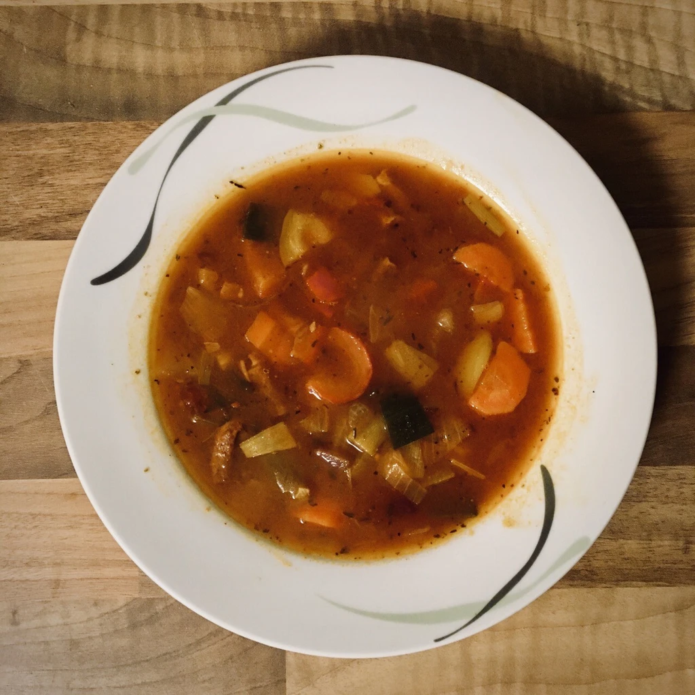
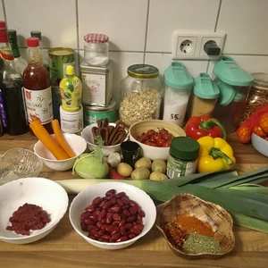
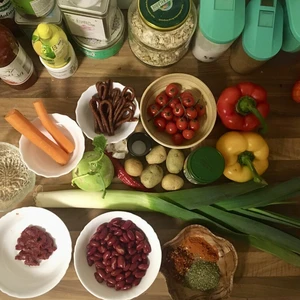
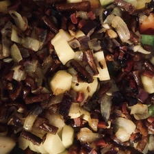
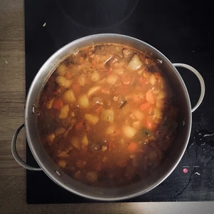

Bei meinem letzten Besuch bei meiner Familie hat mein Vater für uns gekocht. Hierfür hat er eine Bohnensuppe nach serbischer Art zubereitet und etwas abgewandelt. Da mir das Rezept zugesagt hat, wollte ich die Suppe ebenfalls etwas abwandeln. Zu meiner Änderung gehört eine Chilischote und Kohlrabi anstelle von Sellerie, da mir die Zutat gefällt hat.

<!-- more -->

# Zutaten
- 90g vegane Kabanossi oder ein Block räucher Tofu
- Zwei Möhren
- Kohlrabi (oder Sellerie)
- Porree
- Zwei Zwiebel
- Zwei Paprika
- Eine Chilischote
- Zwei Knoblauchzehen
- Vier Kartoffeln
- 400g rote Bohnen (alternativ weiße Bohnen)
- 180g kleine Tomaten
- drei Esslöffel Öl zum angebraten
- ein Teelöffel Salz
- zwei Teelöffel Paprikapulver Edelsüß
- zwei Teelöffel Paprikapulver Scharf
- Salz und Pfeffer zum Nachwürzen
- zwei Esslöffel Tomatenmark
- ein Liter Esslöffel Gemüsebrühe
- zwei Teelöffel Majoran

|||
:---:|:---:
 | 

Zuerst müssen die Tomaten blanchiert werden, damit diese in der Suppe weich und ohne biss bleiben.

Die vegane Kabanossi oder Räuchertofu, Zwiebel, Kartoffel, Paprika, Möhren, Kohlrabi und Porree werden in grobe Stücke geschnitten. Die Chilischote und Knoblauch werden kleingehackt oder geschnippelt.

Danach werden die Kabanossi mit den Zwiebeln und Knoblauch im Topf angebraten, bis die Zwiebel glasig werden. Separiert den Inhalt dann und bratet dann das Gemüse im Topf an.

Zuerst kommen die Paprika mit der Chili hinein, bis diese angebraten sind. Gebt danach die Möhren hinzu, gefolgt von den Kartoffeln, Kohlrabi und Porree. Das ganze sollte dann im Topf gemeinsam braten.

Kocht parallel die Gemüse Brühe mit einem Liter Wasser in einem separaten Topf auf und gießt die Gemüsebrühe dann über das Gemüse und kocht das ganze für 15 Minuten.

Falls ihr die Bohnen aus der Dose nehmt, wascht die ordentlich aus, damit der Geschmack nicht überwiegt.

Tomaten, Bohnen, die angebratenen Kabanossi und das Tomatenmark hinzugeben.

Zum Schluss kommen die Gewürze hinzu. Kocht dann das ganze auf und lasst es auf kleiner Stufe für 30 Minuten köcheln. Danach ist die Suppe bereit verspeist zu werden.

Optional kann zur Suppe vegane Sahne oder Crème fraîche hinzugegeben werden. Dies mildert etwas die Schärfe und rundet den Geschmack ab.
