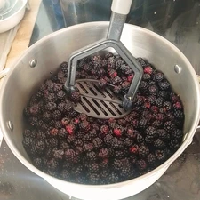
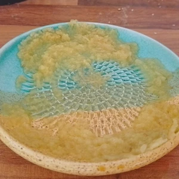
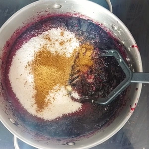
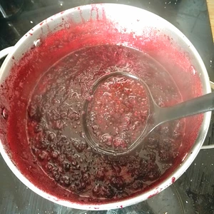
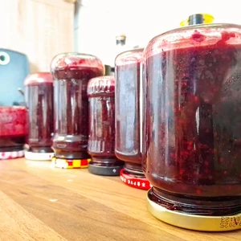

Es ist Sommer und ich bin etwas spät dran, aber noch in der Zeit Brombeeren zu sammeln. Wir haben hier das Glück, dass wir auf dem Berg einen kleinen Wald haben, bei dem die Sträucher viele Beeren tragen, also gibt es jedes Jahr Marmelade.

<!-- more -->

# Zutaten
* 1,3 Kilogramm Brombeeren (alternativ auch Holunderbeeren)
* 2 Teelöffel weihnachtliche Gewürze
* 500 Gramm Gelierzucker 2:1
* Safte einer halben Zitrone
* Zwei daumendick Ingwer

Für die weihnachtlichen Gewürze könnt ihr in gleichermaßen Zimt, Muskatnuss, Pimet, Anis, Kardamom und Nelken im Mörser zermahlen oder entsprecht die Gewürze fertig kaufen und vermischen.

Bevor wir die Marmelade zubereiten, müssen wir Einmach- oder Schraubgläser gut säubern und im Backofen bei ~100 Grad für mindestens 15 Minuten sterilisieren. 

||||
:----:|:----:|:----:
|||

Die Brombeeren säubert ihr vorsichtig in Wasser und entfernt mögliche Reste, welche an den Beeren sich noch befinden, danach legt ihr diese in einen großen Topf und zerdrückt diese mit einem Kartoffelstampfer. 

Den Ingwer reiben wir klein. Ich nutze hierfür einen Reibeteller aus Keramik. Dann können wir Zucker, Gewürze, Zitronensaft und Ingwer zu den zerdrückten Beeren hinzugeben und alles zum Kochen bringen. Rührt währenddessen die angehende Marmelade, damit diese nicht am Topfboden ansetzt, bis diese kocht. 

<video width="50%" height="auto" controls>
 <source src="web/VID_20250812_124623.mp4~2.mp4" type="video/mp4">
Your browser does not support the video tag.
</video>

Sobald es blubbert und schäumt sind es drei Minuten bis wir die Marmelade in die Gläser umgießen können. Befüllt die Gläser bis oben voll, verschließt die Gläser gut und stellt diese kopfüber zum Abkühlen. Somit seit ihr jetzt schon auf Weihnachten gut vorbereitet.

