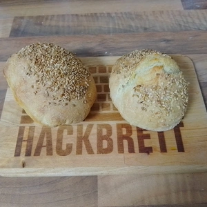

Da ich mich gelegentlich auf Reisen befinde und ich dann nicht immer ein ganzes Brot für die Woche backen kann, backe ich alternativ zu [Brot aus der Pfanne](/articles/duennes-fladenbrot-aus-der-pfanne-2019-07-31/) ebenso auch gerne Brötchen. 
<!-- more -->
Dies Mengen angaben entsprechen für zwei Brötchen.

# Zutaten
* 1 gestrichener Teelöffel Trockenhefe
* 140 g Weizenmehl
* 1 gestrichener Teelöffel Salz
* (Optional) Sesam, Sonnenblumenkerne oder Kürbiskerne
* 120ml kaltes Wasser

Alle Zutaten werden in eine Schüssel gegeben und mit einem Löffel verrührt, aber nicht geknetet. Danach wird die Schüssel mit einem Tuch bedeckt und an einem warmen Ort für acht Stunden gehen gelassen. Am besten über Nacht, damit es am Morgen gleich frische Brötchen gibt. 
Am folge Tag wird der Teig aus der Schüssel auf eine bemehlte Arbeitsfläche gelegt, etwas auseinander gezogen und die Ecken werden zur Mitte gefaltet.
Das Ganze wird abgedeckt und für mindestens 30 Minuten erneut gehen gelassen. 
Während des Wartes können wir den Backofen auf 275 Grad vorheizen.
Nun halbieren (oder dritteln) wir den Teig und formen daraus Fladen. Diese legen wir auf ein mit Backpapier belegtes Blech. 
Bestreicht die Fladen mit etwas Wasser und schneidet diese leicht ein. Jetzt könnte ihr die Brötchen noch mit Körnern bestreuen.
Die Brötchen müssen für 15 Minuten in den Ofen. Sobald diese Goldbraun gebacken wurden, können diese auskühlen.

  
