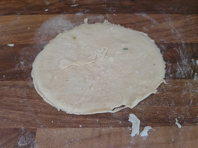
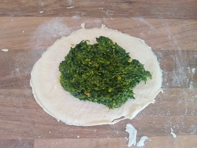
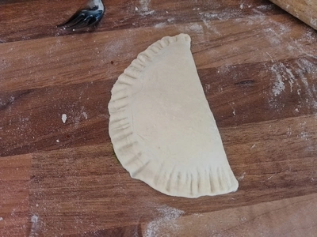
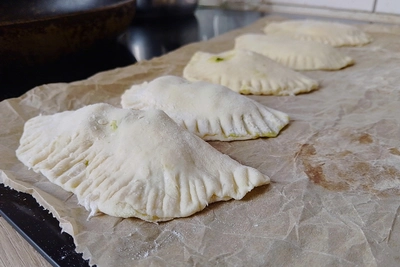
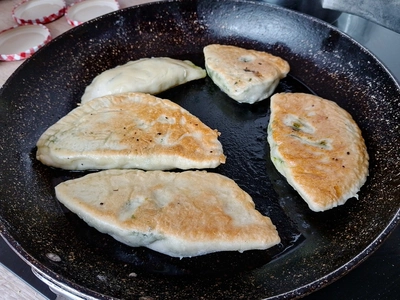
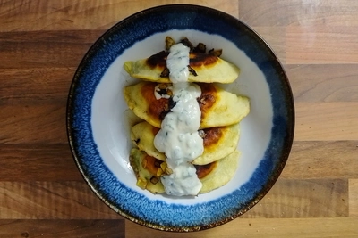

Bolani ist ein gefülltes Fladenbrot aus der afghanischen Küche, das in einer Pfanne in Fett gebacken wird. Für die deutschen, nicht alles, was gefüllter Teig ist, ist eine Maultasche, besonders weil die afghanischen Bolani Brot und keine Nudeln sind und damit auch nicht gegart werden.
<!-- more -->

Für vier Bolani werden folgende Zutaten benötigt:

# Zutaten
* [Bärlauch Pesto](/articles/barlauch-pesto-2026-04-27) (oder eine andere Füllung nach Wahl)
* 100 Gramm Weizenmehl
* 50 Milliliter lauwarmes Wasser
* 1/2 Teelöffel Trockenhefe
* Prise Salz
* Pflanzenöl zum Anbraten

Für die Bolani vermischen wir Salz, Mehl und die Hefe. Dann geben wir langsam das lauwarme Wasser hinzu, während wir den Teig kneten. Sollte der Teig zu trocken sein, gebt minimal Wasser hinzu. Knetet den Teig bis zu Zehn Minuten und lasst diesen dann für eine Stunde ruhen.
Nach der einen Stunde, bemehlen wir die Arbeitsfläche und teilen den Teig in vier Portionen. Daraus formen wir kleine Kugeln, die wir zu Fladen ausrollen. Diese dürfen nicht zu dünn sein, damit diese nicht reißen, entsprechend sind 2 Millimeter dicke ausreichend.

|||||
:----:|:----:|:----:|:----:
|||

Diese Fladen bestreichen wir mit dem Pesto und klappen diesen über die Mitte mit den Enden zusammen, damit wir Halbmonde erhalten. Die Ränder drücken wir mit einer Gabel zusammen und braten dann die Bolni in Öl oder alternativ auch in Margarine Goldbraun.

Im restlichen Öl können wir kleingehackten Knoblauch und Zwiebel anschwitzen und über die Bolani gießen.
Ebenso passt eine Knoblauchtunke aus Soja-Joghurt und frischgepressten Knoblauch mit einem Schuss Kräuteressig. 

|||
:---:|:---:
|
