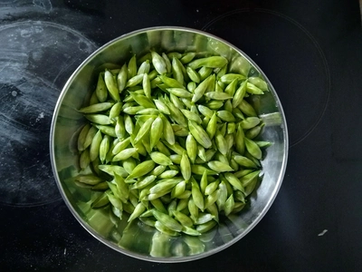
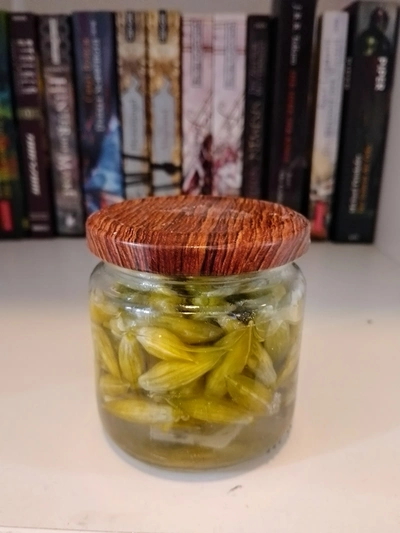

Bärlauch Knospen eigenen sich gut als Knoblauchersatz, zum Beispiel beim Anbraten von Bratkartoffeln.
Damit die länger haltbar sind, können diese auch eingelegt werden.

<!-- more -->

# Zutaten
* 200 Gramm Bärlauchknospen
* 450 Milliliter (Kräuter)Essig
* 1 Esslöffel Zucker
* 5 Pfefferkörner

Die Knospen waschen, Stängel entfernen und in Schraubglas unterbringen, welches vorher bei 140 Grad für 15 Minuten entkeimt wurde.
Essig, Zucker und Pfeffer bringen wir in einem Topf zum Köcheln und lasse es dann für eine Minute stehen
Zum Abschluss wird die Flüssigkeit ins Glas umgefüllt und fest verschlossen. 
Auf den Kopf stellen und für mindestens eine Woche stehen lassen.

