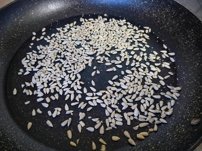
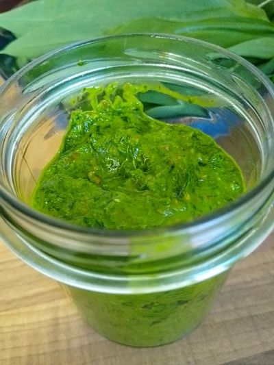
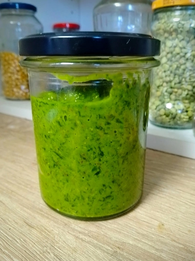
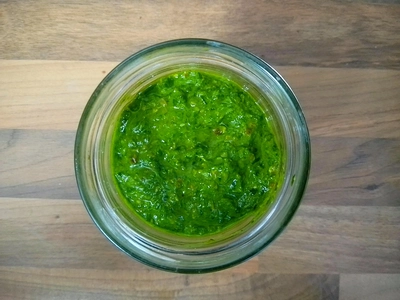

Zu Kartoffeln, Nudeln oder als brotaufstrich, ein Pesto aus Bärlauch ist sehr schmackhaft und einfach zubereitet.

<!-- more -->

# Zutaten
* 100g Bärlauch
* 40g Sonnenblumenkerne
* 1/2 Teelöffelsalz
* 70ml Oliven Öl
* Etwas frischer Pfeffer
* 25 Gramm Hefeflocken

Die Bärlauchblätter werden ordentlich gewaschen und mit einem Küchentuch trocken getupft.
Die Sonnenbklumenkerne werden mit etwas Pfeffer aus der Mühle in einer Pfanne ohne Öl geröstet. 
Wir reiben die Bärlauchblätter (alternativ klein gehackt) und geben dann alle Zutaten in einen Behälter, um diese zu einer Masse pürieren.
Schon ist das Pesto fertig.

Wer möchte, kann dieses erweitern, mit Knoblauch oder veganen Feta.

||||
:----:|:----:|:----:
||

