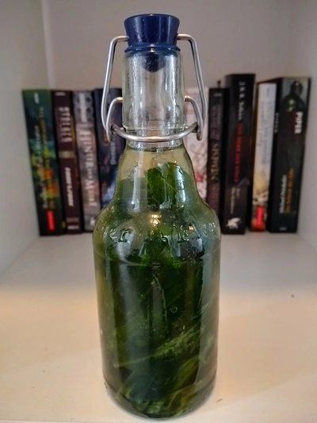

Neben der Trocknung von Bärlauch, kann dieser in Öl eingelegt werden, sodass das Öl den Geschmack einnimmt.
<!-- more -->

# Zutaten
* 50 Gramm Bärlauch
* 250 Milliliter pflanzliches Öl

Hierfür wird nicht viel benötigt. Lediglich pflanzliches Öl wie Raps- oder Sonnenblumenöl und Bärlauchblätter.

Zuerst werden die blätter gewaschen, dann leicht verzwirbelt, damit diese den Geschmack entfalten. Alternativ können die Blätter auch klein geschnitten werden.
Befüllt nun den Bärlauch vollständig mit Öl. Ihr könnt auch ein Essstäbchen nutzen, um den Bärlauch tiefer in die Flasche zu drücken.
Die Flasche wird verschlossen und für bis zu drei Wochen an einem kühlen Ort gelagert.

Nach den Wochen des Wartens siebt ihr den Bärlauch aus und fängt das Öl auf. Zerdrückt auch die Blätter, dass wir jeden Tropfen daraus gewinnen.
Das Öl wird dann wieder in die Flasche gefüllt.
