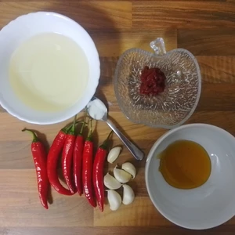
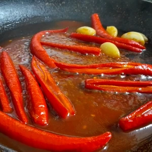

Was ich gerne zum Kochen und Würzen nehme, ist eine Sriracha-Soße. Diese gibt es in unterschiedlichen Facetten, was ich nicht mag ist die Plastik Verpackung.
Deshalb habe ich mich entschieden, eine Chili-Soße selber zu machen, die ich abfüllen kann.

<!-- more -->

# Zutaten
* Wasser
* 6 Knoblauchzehen
* 6 Chilischoten
* 1 Esslöffel [Honig](/articles/loewenzahn-sirup-2019-04-22/)
* 2 Esslöffel mit Tomatenmark
* 1 gestrichener Teelöffel Salz
* 200 Milliliter Weißweinessig

Wir müssen die Knoblauchzehen in einem Topf mit Wasser kurz kochen. Währenddessen schneiden wir die Chilis auf, entkernen diese und **optional** geben diese mit zum Knoblauch.
**ACHTUNG** Der Wasserdampf wird ordentlich in den Augen brennen.
Wir erhitzen eine Pfanne und geben einen Esslöffel [Honig](/articles/loewenzahn-sirup-2019-04-22/) und der Tomatenmark hinzu. Darüber streuen wir das Salz und vermischen alles.

Nun kommen die aufgeschnittenen Chilis, sowie der Knoblauch hinzu. Diese dünsten wir in der Pfanne und passen dabei auf, dass nichts anbrennt. Bevor der Zucker vom [Honig](/articles/loewenzahn-sirup-2019-04-22/) sich langsam karamellisiert, geben wir etwas vom Knoblauchwasser hinzu und den Weißweinessig.
Das ganze lassen wir so lange in der Pfanne, bis die Flüssigkeit dicker wird und die Chilis weich.
Danach wird das ganze mit einem Mixer püriert und in eine Flasche umgegossen.

Dies ist ein Basisrezept und kann zum Beispiel mit mehr Chilis zubereitet werden, oder für den Geschmack mit Gewürzen verfeinert werden. Ebenso kann ich mir gut vorstellen, dass getrocknete Orangenschalen dazu passt. 

  
