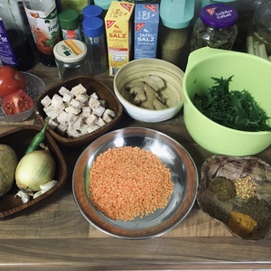
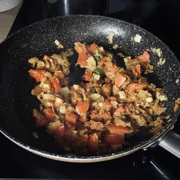
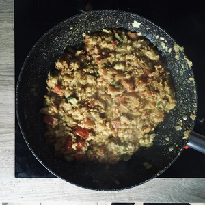
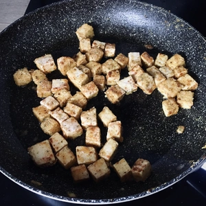
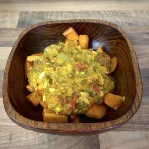

Ich schaue mir gerne Berichte über verschiedene Kulturen an und bei einem der Reportagen welch ich eins sah, wurde in Nepal dieses Gerichtet zubereitet, welches ich veganisierte. Es sieht nach viel aus, aber es ist schnell gekocht. 

<!-- more -->

# Zutaten
* 50g Roten Linsen
* 1x Tofu
* Speisestärke
* Salz zum Würzen
* 1 TL Koriander
* 1 Chili
* 1 TL (Kreuz)Kümmel
* 1 TL Paprikapulver
* 1 TL Zimt
* 1 TL Kurkuma
* 4 Knobi
* Öl zum anbraten
* 1 Zwiebel 100g
* 1 Tomaten (200g)
* 1 Paprika
* Ingwer gerieben zum Anbraten
* 200g Kartoffel
* etwas Muskatnuss und Rosmarin

Zermalmt den Koriander in einem Mörser und vermischt es mit dem (Kreuz)Kümmel, Paprikapulver, Zimt und Kurkuma. Dies wird unsere Gewürzmischung, welche wir später hinzugeben werden.

Kocht die Roten Linsen für 30 Minuten mit einem Deckel auf dem Topf. Währenddessen schneidet eine Paprika in kleine Stücke, würfelt die Zwiebel sowie die Tomaten und hackt den Knoblauch.

Die Kartoffeln werden gewürfelt und mit etwas Öl, Muskatnuss und Rosmarin in einer Schüssel mariniert und dann in einer Pfanne gebraten.

Der Natur Tofu wird ebenfalls gewürfelt und mit etwas Salz, Paprikapulver und Pfeffer gewürzt. Dann in Speisestärke gewälzt. Dies Tofu Würfel werben ebenfalls in einer Pfanne gebraten, bis diese eine knusprige Kruste haben.

Die Paprika wird zu einer Paste im Mörser zerstampft, oder alternativ im Mixer püriert. Erhitzt das Öl in einer Pfanne und reibt dann Ingwer hinein. Bratet den Ingwer klein wenig und gebt dann die gewürfelte Zwiebel und gehackten Knoblauch hinzu. Sobald die Zwiebel gläsern sind, gebt die Paprika Paste und die gewürfelten Tomaten hinzu, sowie eine klein geschnittene Chili und verrührt das ganze bevor ihr unsere Gewürzmischung hinzugebt. Erneut wird das ganze verrührt und weiter gebraten, bis die Roten Linsen so weit sind. Diese werden mit in die Pfanne gegeben und unter die Würzmischung-Paste gemischt. Macht einen Deckel drauf und kocht das ganze für Fünfminuten auf einer kleinen Flamme.

||||
:----:|:----:|:----:
||

Zum Schluss kann Tofu mit den Kartoffeln auf einem Teller serviert werden, worüber wir unser Dal portionieren können.

  
