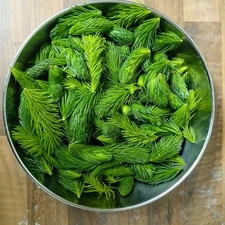
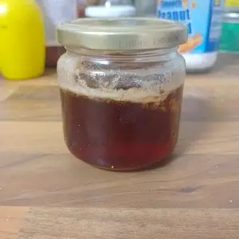

Mai ist die Zeit, in der Nadelbäume ihre Triebe wachsen. In dem Zustand sind diese noch frisch und saftig und können nicht nur zu einen leckeren Pesto verarbeitet werden, sondern auch zu einem Sirup.

<!-- more -->

**Hinweis** Macht euch bitte schlau, wie Tannen, Fichten und Eiben erkannt werden können. Die Eibe ist giftig und kann weit aus mehr Schaden einrichten als nur Bauchschmerzen. Die einfachen Erkennungsmerkmale sind, dass die Nadeln sichelförmig und Flach sind. Erinnern etwas an eine kleine Palme. Die Nadeln sind Flach wie bei einer Tanne aber einheitlich Grün. Zusätzlich wachsen bei der Eibe rote, giftige Beeren. Liest mehr zur Eibe in der [Wikipedia](https://de.wikipedia.org/wiki/Europ%C3%A4ische_Eibe).

# Zutaten
* 100 Gramm Nadeltriebe
* 150 Gramm Zucker
* 250 Milliliter Wasser
* Zitronensaft

Legt die Triebe in einen Topf mit Wasser und lasst diese mit Deckel darauf für 30 Minuten köcheln. Danach lässt ihr dies für einen Tag stehen. 
Am nächsten Tag entnehmt ihr die Triebe aus dem Wasser, gegebenenfalls filtert ihr das Wasser, falls zum Beispiel einzelne Nadeln im Wasser schwimmen sollten.
Nun kommt der Zucker und ein Schuss Zitronensaft hinzu.
Das Ganze wird jetzt auf kleiner Flamme gekocht, bis der Sirup die gewünschte Konsistenz hat. 
Nach meiner Erfahrung sollte dies nach etwa neunzig Minuten eingedickt sein. Je länger es köchelt, desto dickflüssiger wird die Konsistenz.

  
