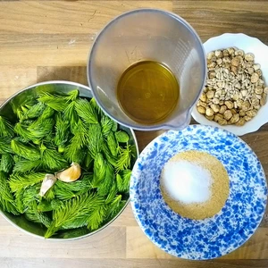
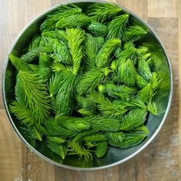
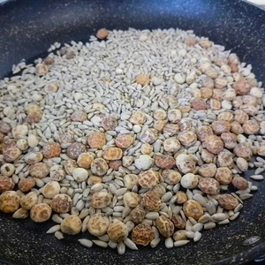

Bevor der Mai vorbei ist und alle Triebe ausgewachsen sind, möchte ich meinen letzten Versuch mit euch teilen. Ein Pesto aus Fichten und Tannenspitzen.
Darauf gekommen bin ich, als ich eine Reportage über Finnland angesehen habe, um welchen es eigentlich um ein Fichtensirup ging, welch ein Tierhalter im freien auf seine traditionelle Teigware goss.

<!-- more -->

# Zutaten
* 250 Gramm Fichten/Tannentriebe
* 150 Milliliter Olivenöl
* 100 Milliliter Wasser
* 90 Gramm Sonnenblumenkerne
* 100 Gramm Erdmandeln oder Cashewnüssen
* 5 Esslöffel Hefeflocken
* 2 Teelöffel Salz
* 2 Knoblauchzehen

**Hinweis** Macht euch bitte schlau, wie Tannen, Fichten und Eiben erkannt werden können. Die Eibe ist giftig und kann weit aus mehr Schaden einrichten als nur Bauchschmerzen.
Die einfachen Erkennungsmerkmale sind, dass die Nadeln Sichelförmig und Flach sind. Erinnern etwas an eine kleine Palme. Die Nadeln sind Flach wie bei einer Tanne aber einheitlich Grün. Zusätzlich wachsen bei der Eibe rote giftige Beeren. Liest mehr zur Eibe in der [Wikipedia](https://de.wikipedia.org/wiki/Europ%C3%A4ische_Eibe).

Die Cashewnüsse oder Erdmandeln mit Sonnenblumenkernen in einer Pfanne ohne Öl rösten. Beginnt mit den Erdmandeln, wenn ihr welche benutzt. Diese brauchen etwas länger und sind dann leichter zu verkleinern. 
In einen hohen Behälter gibt ihr nun die Triebe der Tanne und Fichte hinein und begießt es mit 150 Milliliter Olivenöl. Dann kommen die Hefeflocken, Salz und grob gehackte Knoblauchzehen. Die gerösteten Erdmandeln bzw. Cashewnüsse hinzugeben, sowie die Sonnenblumenkerne und gebt etwas vom Wasser hinzu. Püriert dies mit einem Stab oder Standmixer und gebt nach und nach das Wasser hinzu. 
Füllt das Pesto in ein Schraubglas um und lagert dieses im Kühlschrank.

Das Pesto schmeckt besonders in Verbindung von Nudeln oder auch bei Kartoffelgerichten. Als Aufstrich auf dem Brot ist es ebenfalls sehr lecker.
  
