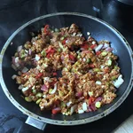

Außen knusprig, innen saftig und das Ganze ist auch nicht schwer nachzumachen. Diese Taler eigenen sich ebenso gut als Snack oder Vorspeise. Für Acht solcher Taler benötigt man nicht viel und lediglich die Vorbereitung des Hacks nimmt gegebenenfalls Zeit in Anspruch.

## Zutaten

* 200g Maismehl
* 200ml Wasser
* Prise Salz
* (Hafer) Hack
* eine Chilischote
* ein TL Paprika gewürz
* etwas Pfeffer
* ein EL Tomatenmark
* ein EL Sojasoße
* ein EL Honig
* eine Schalotte
* zwei Knoblauch Zehen
* Öl zum Frittieren

||||
:----:|:----:|:----:
|||

## (Vorbereitung) Hack

Die Schalotte, Chilischote und das Knoblauch werden klein geschnitten und dem Hack hinzugegeben. Das Tomatenmark wird mit der Sojasoße und Honig vermischt und mit dem Hack vermischt. Dass ganze wird mit dem Paprikapulver, Salz und Pfeffer gewürzt. Nach dem Würzen soll das ganze ziehen, je länger, desto besser. In meinen Fall waren dies 24h, dies kann aber auch um einiges kürzer sein (10 Min). Nachdem das Hack gezogen hat, kann dieses ganz Regulär angebraten werden.

Die Erbsen im Bild stammen bei mir aus dem Hafer Hack Rezept, welcher aus den Resten meiner [Hafermilch](/articles/hafermilch-2022-01-29) entstand.

## Maistaler

Nun können wir uns an die Maistaler machen. Hierfür wird das Wasser mit dem Maismehl vermischt und geknetet bis wir eine glatte Kugel erhalten, welche nicht zerbröselt. Stellt eine Schalle mit etwas Wasser bereit, um die Hände zu befeuchten und nutzt eine nicht haftende Oberfläche. Zum Beispiel eine Silikonmatte oder Frischhaltefolie.

|||
:----:|:----:
 | 

Rollt den Teig nicht zu dünn aus und stecht runde Fladen mithilfe eines Glases oder Ausstechform heraus. Diese befüllt ihr dann mit dem Hack und bedeckt dies mit einem zweiten Fladen, drückt dabei die Ränder zusammen. Mit leicht befeuchteten Händen können diese nun mit den inneren Handflächen zu den Talern gedrückt werden und verschlossen werden.

Sobald ihr die Taler fertig habt, erhitzt ausreichend Öl in einem Topf, damit die Taler darin schwimmen können und bedeckt sind. Sobald das Öl heiß ist, legt die Taler vorsichtig rein und stößt diese nach wenigen Augenblicken an, damit die nicht am Boden des Topfes anbraten. Nun gilt es zu warten, bis die Taler oben schwimmen. Während des Wartens können wir das Patriarchat anzünden.

Die Taler sind fertig, sobald diese Gold-Braun sind und oben schwimmen. Nehmt diese vorsichtig heraus und legt diese auf ein Küchentuch damit diese Abtropfen und leicht abkühlen.

Geschmacklich passen hierzu BBQ Dips oder auch eine Süße Chili Soße. Der Inhalt kann auch zusätzlich alternativ noch mit Schmelz erweitert werden.

||||
:----:|:----:|:----:
||
