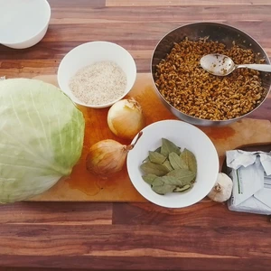
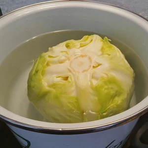
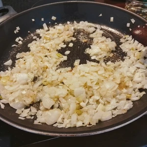
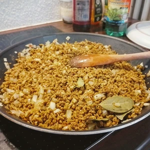
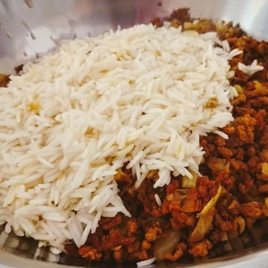
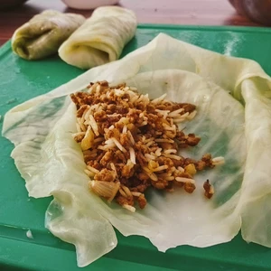
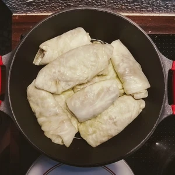
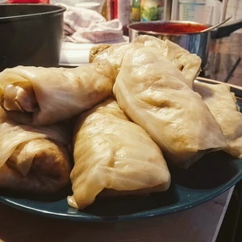

Bei Gołąbki [ɡɔˈwɔmpki] handelt es sich um ein traditionelles polnisches Essen, was im deutschen soviel bedeutet wie Täubchen. Dabei handelt es sich um Kohlrouladen mit Reis, in einer Tomatensauce.

<!-- more -->
Durch den Kohl und die mehrere Schritte, ist die Zubereitung von Gołąbki aufwendig, wenn auch nicht schwer. 

# Zutaten
* 1KG Kohlkopf oder Wirsing
* 0,5 kg Hack (z.b. [Haferhack](/articles/hafer-hack-2022-09-12/) oder [Okara](/articles/okara-2023-02-04/))
* 1 Zwiebel
* 4 Knoblauchzehen
* Margarine zum Anbraten
* 100 g Reis
* 4 TL Zucker
* Lorbeerenblätter
* Nelken
* 200 g Tomatenmark
* Salz
* Pfeffer
* 700ml Wasser
* 1 EL Stärke
* Gewürze:
  * 1/2 TL Oregano
  * 1/2 TL Basilikum
  * 1/2 TL Knoblauchgranulat
  * Prise Salz
  * Pfeffer
  * 1/2 TL Zucker

Zusätzlich benötigen wir einen großen Topf, in dem der Kohlkopf gekocht werden kann. 

Schneidet den Kohlstrunk etwas heraus und entfernt die äußersten Blätter, legt dann den Kohlkopf in einen ausreichend großen Topf und kocht den Kohl im Wasser, welches mit Zucker vermischt wurde, bis die Blätter weich werden.

 
In der Zwischenzeit können wir die Zwiebel leicht anbraten und optional mit etwas Zucker karamellisieren. Daraufhin folgt das Hack, welches lediglich ca. 10. min braten muss. In der Zeit können wir die 100 g Reis kochen, welche später mit dem Hack vermengt wird.

Sobald Reis und Hack so weit sind, vermischt beides in einer Schüssel und presst die Knoblauchzehen hinzu. Würzt das ganze mit Salz und Pfeffer und verknetet alles zu einer Masse, damit ist die Füllung fertig.

||||
:--:|:--:|:--:
||

Der Kohl sollte in der Zwischenzeit auch soweit sein. Holt diesen aus dem Topf und schält die einzelnen Blätter ab. Gegebenenfalls ist der Kohl noch recht heiß vom Kochen, so könnt ihr diesen abkühlen lassen, bevor wir die Blätter mit unserer Masse befüllen. Vorher muss aber noch der Hauptnerv bei den Blättern fein abgeschnitten werden, damit sich die Kohlblätter auch rollen lassen. 

Durch die Kohlblätter, sind keine Schnüre oder desgleichen nötig, da die Gołąbki zusammen gerollt von sich aus halten.
Befüllt nun die Kohlblätter, klappt links und rechts die Enden leicht ein und rollt dann von unten nach oben den Kohl zusammen, sodass das Ende auf dem Boden liegt und sich die Rollladen nicht öffnen. Mit den restlichen Blättern bedecken wir den Boden des Topfes. Danach legt ihr die Rollladen eng nebeneinander auf die Blätter, gebt noch Nelken und Lorbeerenblätter hinzu und lass das ganze noch für eine Stunde köcheln.

|||
:--:|:--:
|

Da wir uns kurz vor dem Ende befinden, kann noch die Tomatensauce zubereitet werden. Hierzu bringen wir 700 ML Wasser zu kochen und vermischen dies mit den 200 g Tomatenmark. Wir würzen das ganze mit Oregano, Basilikum, Knoblauchgranulat, Salz, Pfeffer, Zucker und vermischen 1 EL Stärke mit etwas Wasser, damit wir die Tomatensauce andicken können.

Smacznego.
