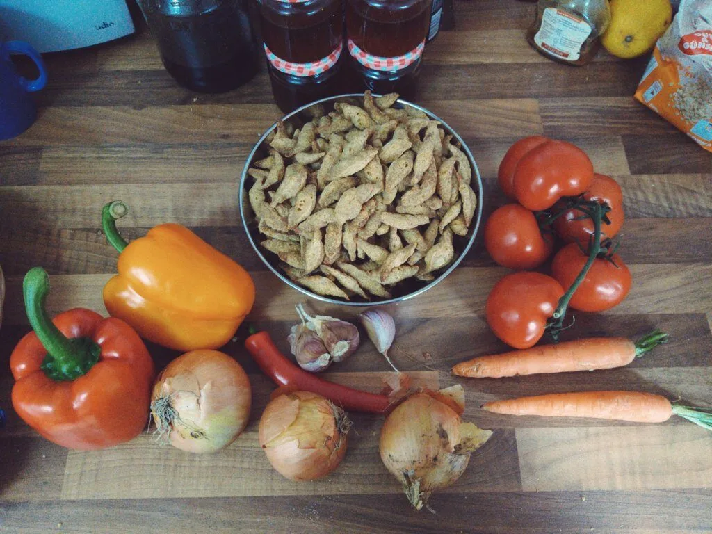
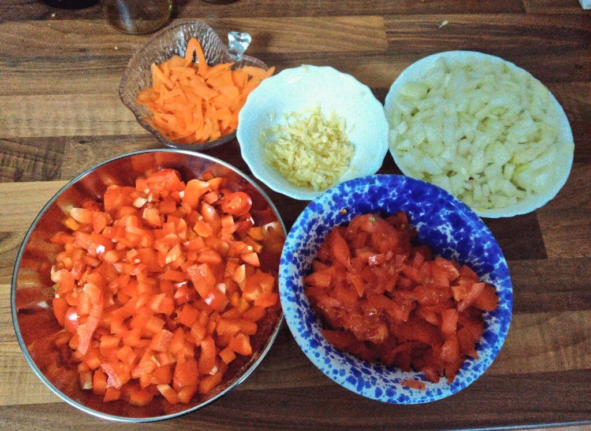
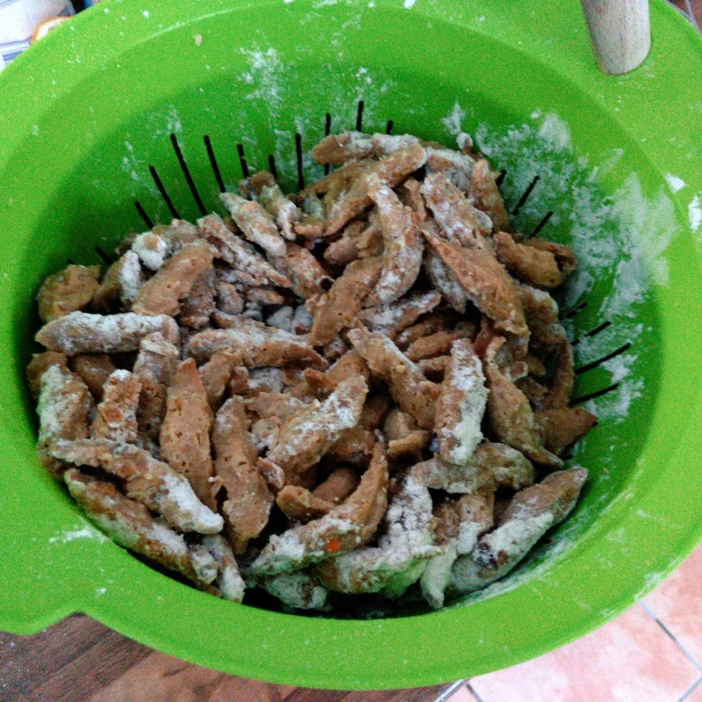
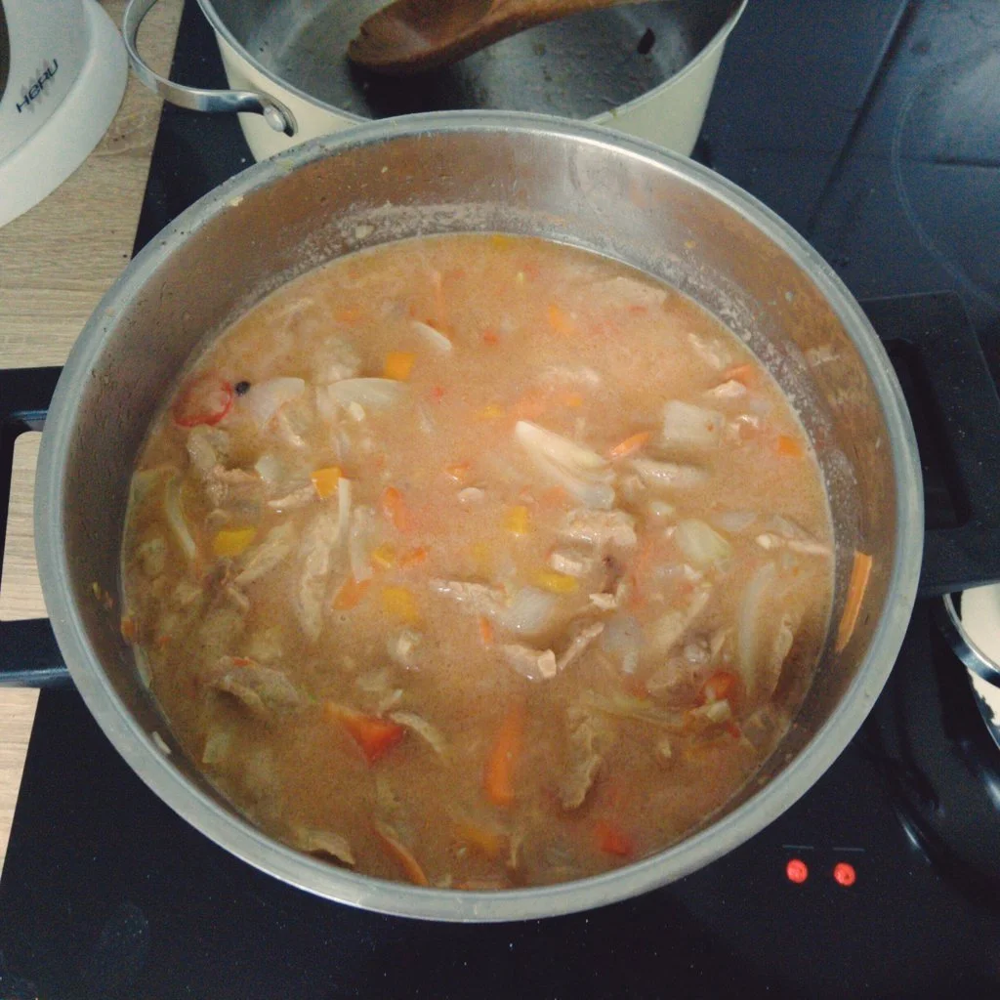

Eigentlich wäre am letzten Wochenende die Gulasch-Programmier-Nacht gewesen. Diese fiel bekanntlich wegen einer Pandemie aus. Wie der Titel es vermuten lässt, handelt es sich um ein Hack\*Innen Event an dem Gulasch serviert wird. Um eine Gulasch Remote Experience zu erhalten, wurde ein Topf herangeholt und gekocht.

Was wir für 8-10 Portionen benötigen ist zuerst ein großer Topf, Geduld und folgende Zutaten:

- 250 g Soja Schnetzel/Chunks
- Gemüsebrühe
- 3 Zwiebel
- 3 Konblauchzehen
- 2 Paprika
- 1 Chilischote (optional, ich mag es schärfer)
- 2 Möhten
- 300 g Tomaten
- Mehl
- Olivenöl zum Anbraten
- Prise Salz
- Pfefferkörner
- 1 L Wasser zum Kochen
- 1,4 L Wasser für die Soja Schnetzel

Zuerst bereiten wir die Soja Schnetzel oder Chunks in einem separaten Topf vor.

Bringt die 1,4 L Wasser zum Kochen und verrührt 2 TL Gemüsebrühe dazu. _Ich mische immer noch zusätzlich ein Teelöffel Gewürz nach Wahl hinzu, um den Geschmack zu variieren_. Gebt die Soja Schnetzel hinzu und lasst diese für 15 Minuten das Wasser ziehen. Danach trennt ihr das Wasser von den Schnetzel/Chunks und lasst diese abtropfen, presst auch leicht das Wasser aus diesen heraus. Währenddessen könnt ihr, wenn noch nicht geschehen, die Zwiebel, Tomaten, Chili und Paprika klein und die Möhren in Streifen schneiden.

Bemehlt die Chunks und bratet diese im großen Topf leicht im Öl an und nehmt diese aus dem Topf wieder heraus. Daraufhin werden im Topf die Zwiebel scharf angebraten. Gebt dann die Paprika und Chili hinzu. Gebt eine Prise Salz hinzu und etwas schwarzen Pfeffer aus der Mühle. Reibt den Knoblauch über das Gemüse, verrührt das ganze und lasst es für ca. 5 Minuten braten. Schüttet einen Liter Wasser darüber und gebt die Tomaten hinzu. Diese müsst ihr nun unterrühren. Zum Schluss kommen die Schnetzel/Chunks wieder in den Topf rein, sowie 10 Pfefferkörner. Das Ganze wird dann für mindestens 3 Stunden auf kleiner Flamme mit Deckel gekocht. Gelegentliches Umrühren nicht vergessen.  

Sollte nach den drei Stunden das Gulasch noch zu flüssig sein, kann ein Teelöffel Speisestärke hinzugegeben werden, damit das Gulasch dicker wird. Wenn es zu dick wird, einfach während des Kochens Wasser hinzugeben.  

Zu Gulasch passt Brot, Nudeln, Reis und was ich empfehle, sind Koardowwelbuffa 👌‍‍. Da bleibt es nur noch nen gudden zu wünschen.

