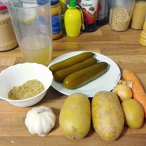
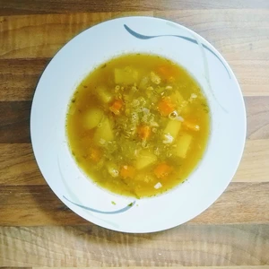

Vor nicht allzu langer Zeit habe ich ein Rezept für polnische [Sauer-Eingelegten-Gurken(Ogórki Kiszony)](/articles/ogorki-kiszony-2023-09-07/) aufgeschrieben. Was macht eins aber mit dem Gurkenwasser? 
Schon einmal Gurkensuppe probiert?

<!-- more -->

# Zutaten
* 3 große Gurken
* 220g Kartoffeln
* 1 Möhre
* 1 Zwiebel
* Knoblauch nach Wahl (Optional)
* 500ml Gurkenwasser
* 500ml Brühe (2 EL [Gemüsebrühe](/articles/gemusebruhe-2024-01-28/))
* Prise Salz
* 4 EL Sahne

Für die Suppe werden die Gurken klein gerieben. Kartoffel, Möhren und Zwiebel werden gewürfelt, der Knoblauch wird kleingehackt.
Bringt 500ml Wasser zum Kochen und gebt die Gemüsebrühe hinzu. Nach fünf Minuten werden Kartoffeln, Möhren, Zwiebel und Knoblauch in die Brühe gegeben und für 15 Minuten mit einem Deckel auf dem Topf gekocht.
Gebt danach die geriebene Gurken und das Gurkenwasser hinzu. Das Ganze wird erneut für 15 Minuten gekocht, bevor die Sahne hinzukommt und somit serviert fertig ist.

  
