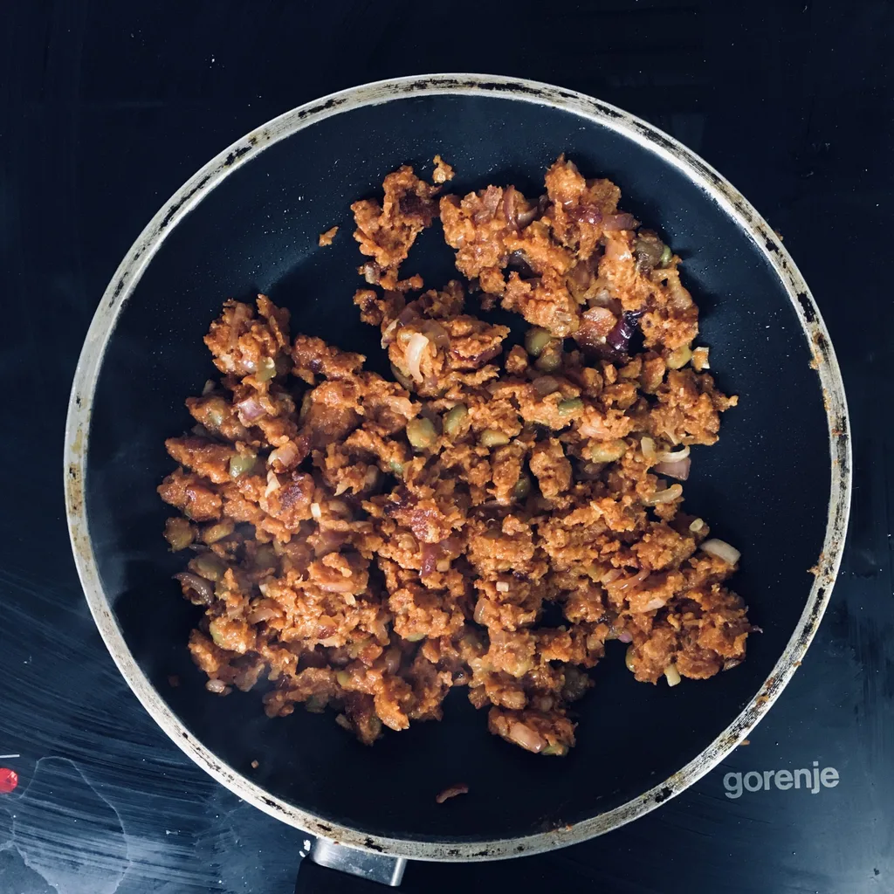
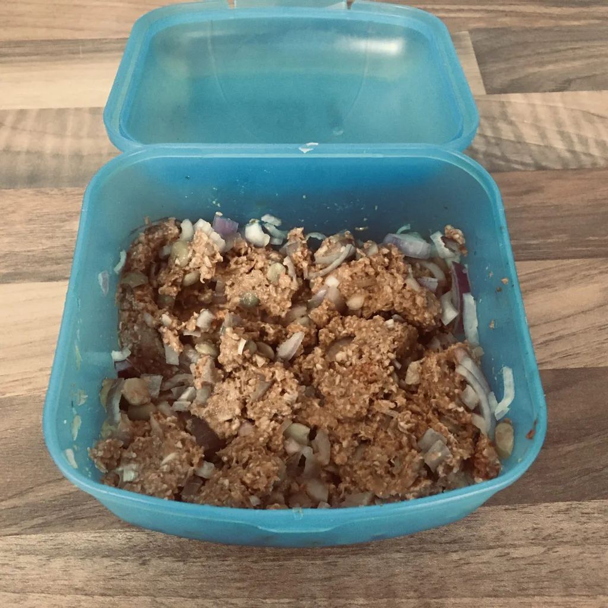

Wer selber [Hafermilch](/articles/hafermilch-2022-01-29) macht, kann aus den Resten entweder eine Kochcreme machen oder auch Hack. Auf den ersten Blick kommt das etwas wenig vor, da im Rezept zur [Hafermilch](/articles/hafermilch-2022-01-29) Produktion 100g Hafer erwähnt werden. Jedoch verarbeiten wir die Masse weiter und fügen weitere Zutaten hinzu, wodurch das ganze gestreckt wird.

## Zutaten

* Hafermasse (Reste aus der [Hafermilch](/articles/hafermilch-2022-01-29) Produktion)
* Paniermehl (π * 👍‍ Angabe im Rezept).
* 1 EL Tomatenmark
* etwas Pfeffer
* 1 EL [LöwenzahnSirup](/articles/loewenzahn-sirup-2019-04-22) (oder anderer Honigersatz)
* 1 EL Sojasoße
* 1 Schalotte
* 1 Knoblauchzehe
* 2 TL Paprikapulver
* Weitere Kräuter und Gewürze nach Wahl

Aus der Masse, welche wir aus dem Sieb oder Nussbeutel entnehmen, müssen wir soviel Feuchtigkeit wie Möglich auspressen. Legt die Masse in eine Schale und bedeckt diese mit Paniermehl. Hackt die Schalotte in kleine Würfel, reibt die Knoblauchzehe, mischt danach die restlichen Zutaten mit der Schalotte und dem Knoblauch unter die Hafermasse und bedeckt die Masse erneut mit etwas Paniermehl. Knetet alles ordentlich zu einer neuen Masse und lasst das Hack für mehrere Stunden ziehen. Danach kann es wie gewohnt in der Pfanne mit zum Beispiel Öl angebraten werden.

**Hinweis:**

*Je nach restlicher Feuchtigkeit kann es sein, dass es etwas Zeit in Anspruch nimmt, bis das Hafer-Hack in der Pfanne schön braun wird.*
