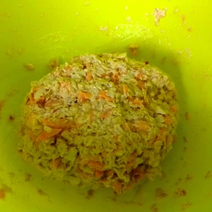
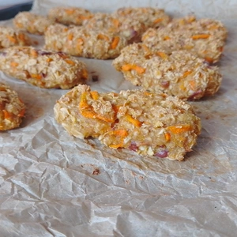
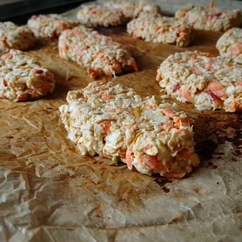
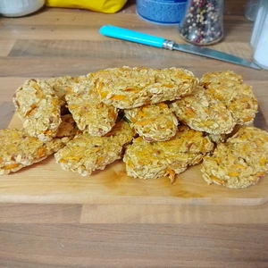

Da ich viel mit dem Rad unterwegs bin und ein kleiner Snack immer dabei sein muss, damit der kleine Hunger bekämpft werden kann und neue Energie zu liefern.

<!-- more -->

# Zutaten
* 300 g Äpfel
* 100 g Karroten
* 150 g Haferflocken
* 100 g Mehl
* 1 EL Stärke
* 1 EL [Honig](/articles/loewenzahn-sirup-2019-04-22/)
* Prise Salz

* Block Schokolade zum Glasieren (Optional)

Da die Zubereitung sehr schnell geht, heizen wir den Ofen auf 200 Grad Ober- und Unterhitze vor. 
Äpfel und Möhren werden klein gerieben, bevor die restlichen Zutaten dazu getan werden. Danach wird alles ordentlich verknetet. Das ist eine klebrige Angelegenheit.

||||
|---|---|---|
||||

Wir rollen danach Kugeln aus dem Teig, welche daraufhin zu Riegel geformt werden und auf ein Backblech mit Backpapier gelegt werden. Diese kommen dann für 20 Minuten in den Ofen. Nach dieser Zeit werden die Riegel gewendet und für weitere 10 Minuten gebacken. Gut auskühlen lassen, bevor diese optional weiter verarbeitet werden. Nachdem auskühlen können wir die Blockschokolade in einem Wasserbad zum Schmelzen bringen und die Riegel darin Baden und dann erneut auf einem Backpapier aushärten lassen. Im Kühlschrank halten sich die Riegel bis zu einer Woche.

  
