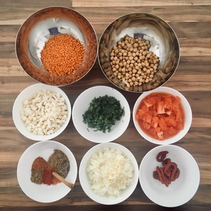
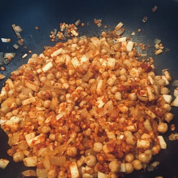
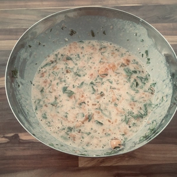
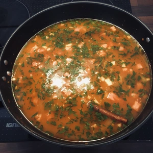
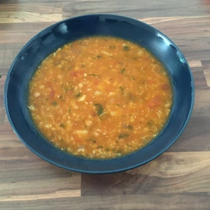

Die traditionelle Suppe Harira stammt aus der nordafrikanischen Küche und ist besonders in Marokko beliebt. Die Suppe ist Bestandteil während des Ramadan, wenn die Menschen nach Sonnenuntergang wieder Speis und Trank zu sich nehmen dürfen. Hier folgt meine vegane Variante.

<!-- more -->

# Zutaten

* 200g Gekochte Kichererbsen
* 150g Rote Linsen
* 400g Tomaten
* 150g Knollensellerie
* 15g Petersilie
* 1 Zimtstange
* 1 Zwiebel
* 2 Knoblauchzehen
* 1 gehäufter TL Koriander
* 1 gestrichener TL Kümmel
* 1/2 TL Harissa Gewürz
* 1/2 TL Paprikapulver
* 2 EL Tomatenmark
* 3 TL Salz
* 1 TL gemahlener Pfeffer
* 1 TL Chilipulver
* 1 Messerspitze Safran
* Ingwerstreifen
* 1 Schuss Zitrone
* 1.75L Wasser
* 50g Stärke oder Mehl

||||
:----:|:----:|:----:
 |  | 

Falls ihr Kichererbsen aus der Dose benutzt, wascht diese aus. Getrocknete Kichererbsen müssen vorher gekocht werden.
Blanchiert im Vorfeld die Tomaten und hackt diese in Würfel.
Hackt die Zwiebel mit Knoblauch in Würfel und schwitzt diese an, bis die etwas Farbe erhalten. 
Der Knollensellerie wird ebenfalls klein gehackt und mit den Linsen und Kichererbsen in den Topf hinzugegeben.
Danach folgt das Tomatenmark, Koriander, Kümmel, Harissa, Paprikapulver, Salz, Pfeffer, Chilipulver und Safran. Rührt das ganze ordentlich durch und röstet alles an.
Nun kann das Wasser in den Topf gegeben und umgerührt werden. Währenddessen wird die Stärke mit 50ml Wasser mittels Schneebesen verrührt, sodass keine Klümpchen mehr bestehen. Jetzt können die gehackten Tomaten und Petersilie zur Stärke gegeben werden und umgerührt werden. Zum Schluss kommt dies in die Suppe bei kleiner Hitze zum Andicken. 
Jetzt kommen noch die Ingwerstreifen und ein Schuss Zitronensaft hinzu. Das ganze muss jetzt 30-40 auf kleiner Flamme köcheln. Die Konsistenz ist richtig, wenn die Suppe etwas dicker ist.

Tipp: Die Reste lassen sich am nächsten Tag prima mit Paprika und Chilischoten erneut aufkochen und als Soße für Reis servieren.

  
