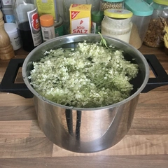
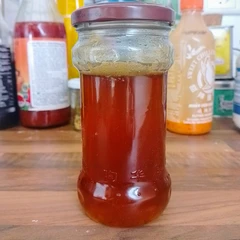

Die Sommerzeit ist die Zeit von Holunderblüten und diese können nicht nur in Pfannkuchen verarbeitet werden, sondern sind ebenso als Sirup ein wunderbarer Honigersatz und süßen Nachtisch wie Waffeln.

<!-- more -->
Sammelt die Dolden abseits der Straße, achtet darauf, dass alle Knospen offen sind und nicht befallen sind. 
Diese schüttelt ihr sanft ab, um eventuelle Insekten abzuschütteln. 

# Zutaten
* 200 Gramm Blüten
* Zwei Liter Wasser
* 1 EL Zitronensaft
* 1 KG Zucker
* Frische Minzblätter (Optional)

Legt 200 Gramm der Dolden mit Minzblättern (optional) in einen Topf mit zwei Liter Wasser für mindestens einen Tag ein und lasst das Wasser den Geschmack vom Holunder ziehen. 
Nach mindestens vierundzwanzig Stunden, nehmt ihr die Dolden aus dem Wasser, drückt die vor dem Entsorgen aus und filtert das Wasser. 
Gebt nun den Zucker und Zitronensaft hinzu und bringt die Flüssigkeit zum Kochen. Rührt dabei den angehenden Sirup um, damit sich der Zucker verteilt. 
Sobald das Wasser kocht, stellt auf eine kleine Flamme, damit der Sirup die nächsten Stunden vor sich her köchelt, das Wasser verdampft und sich Zucker mit dem Saft vermischt. 
Dabei muss immer wieder umgerührt werden. Je länger das ganze kocht, um dickflüssiger wird es. Deshalb nehmt gelegentlich eine Probe, in dem ihr mit einem Löffel gelegentlich klein wenig abschöpft und auf einem Teller abkühlen lässt. So könnt ihr die Konsistenz testen und für euch entscheiden, wann der Sirup fertig ist. 
Nach meiner Erfahrung ist dieser so weit, sobald sich der abgekühlte Sirup zwischen den Fingern, Fäden zieht.

