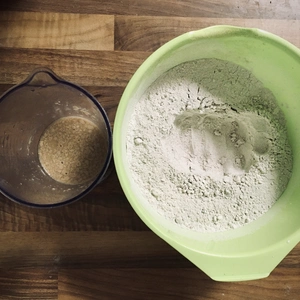
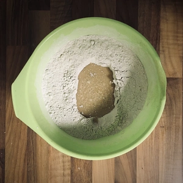
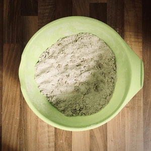
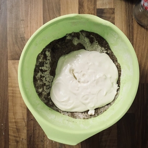
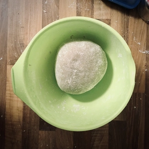
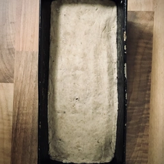
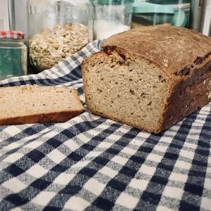

Bei diesem Brot kommt eine gewisse Luftigkeit, durch den Joghurt, ins innere vom Brot und der Fenchel gibt eine kleine Würze hierzu.

<!-- more -->

# Zutaten
* 300g Soja oder Hafer Joghurt (lauwarm)
* 100ml Milch zum Beispiel [Hafer-](#) oder [Sojamilch](#) (lauwarm)
* 2 EL Sonnenblumen Öl
* 300g Roggenmehl (Type 997)
* 150g Dinkelmehl (Type 630)
* 7g Trockenhefe
* 1 EL [Honigersatz](#)
* 1 TL Salz
* 2 TL Fenchel

||||
:---:|:---:|:---:
||

Die Milch sollte lauwarm sein, damit die Trockenhefe darin aufgelöst werden kann. Gebt hierzu noch den Esslöffel Honigersatz hinzu und verührt das ganze. Während die Hefe in der warmen Milch leicht anfängt zu arbeiten, vermengen wir die beiden Mehlsorten in einer Schüssel und schaffen ein Mulde.
Nun wird die Milch mit der Hefe in die Mulde gegossen und mit etwas Mehl vom Rand verühren und zugedeckt an einen warmen Ort für mindestens 30 Minuten gehen lassen.

||||
:---:|:---:|:---:
||

Verstreut das Salz und fenchel am Rand der Schüssel und gebt das Öl und den Joghurt hinzu. Jetzt kann alles verknetet werden. Streut etwas Mehl ünter den Teig, sollte dieser noch klebrig sein. Nach dem kneten muss der Teig erneut für mindestens 30 Minuten ruhen, bevor dieser in eine gefettete Kastenform gefüllt wird.

Stell eine mit Wasser gefüllte Schale auf den Ofenboden und heizt den Ofen auf 240 Grad Ober- und Unterhitze vor. Sobald der Ofen soweit ist, wird das Brot für Fünfzehn Minuten vorgebacken, bevor die Schale aus dem Ofen entnommen wird und der Ofen auf 200 Grad heruntergestellt wird. 
Das Brot bleibt dann für weitere 25 Minuten im Ofen, bevor dieses Fertig gebacken ist.

