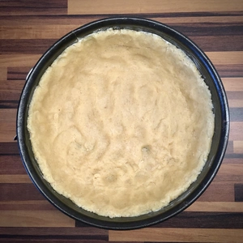
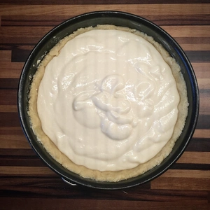
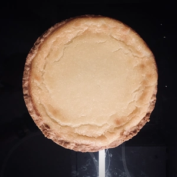
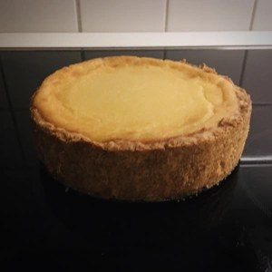
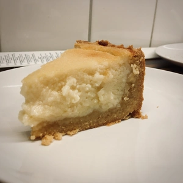

Einige können sich noch an das [Cheesecake Rezept](/articles/american-cheesecake-style-2018-12-04/) erinnern. 
Auf dieser Basis habe ich nun ein Rezept für Käsekuchen geschrieben und es etwas vereinfacht. Die Vorbereitung und Backzeit nimmt etwa zwei Stunden in Anspruch, da wir einen Mürbeteig machen müssen.

<!-- more -->

# Zutaten

## Mürbeteig
* 250g Mehl Typ 405 oder 550
* 2 TL Backpulver
* 125g Margarine (Tipp: Alsan Margarine)
* 80g Rohrzucker
* 1 Prise Salz
* 3 EL kaltes Wasser

Vermischt Mehl, Backpulver, das Rohrzucker und Salz miteinander. Zum Schluss gebt ihr die Margarine in kleinen Stücken hinzu sowie die drei EL kaltes Wasser, da das verkenten sonst mehr Arbeit in Anspruch nimmt. 
Andere Margarine, welche eher weicher sind, können auch genutzt werden, es empfiehlt sich aber die vegane Alsan (oder eine passende Alternative) hierfür zu benutzen.
Nun kann der Teig mit Knethaken oder der Hand geknetet und zu einer Kugel geformt werden. Diese kommt zum Schluss für mindestens 30 Minuten in einer Frischhaltefolie in den Kühlschrank.

## Füllung
* 500g Vanille Soja Joghurt 
* Alternativ: Natur Soja Joghurt mit Vanille, Aroma oder Vanillezucker hinzugeben.
* 150g Zucker 
* 3 EL [Honigersatz](/articles/loewenzahn-sirup-2019-04-22/)
* 50g Maisstärke
* 125g Margarine

Bei einer Streichfesten Margarine wie die der von Alsan, empfiehlt es sich diese vorher auf kleiner Flamme zu schmelzen.
Für die Füllung werden alle Zutaten in einer Schüssel vermischt. Dies funktioniert gut mit einem Schneebesen oder einem Mixer.

||||
:---:|:---:|:---:
||

Bereitet nun den Backofen vor und heizt diesen auf 180 Grad Ober- und Unterhitze vor.
Währenddessen kann der Teig aus dem Kühlschrank und in einer eingefetteten Springform (20cm) ausgedrückt werden. 
Dabei sollte der Boden recht Dünn sein und die Wände bis zum oberen Rand gedrückt werden. Nehmt hierzu eure Daumen zur Hilfe.
Ist die Form mit dem Teig ausgekleidet, kann zum Schluss die Füllung in die Springform gegossen werden. 

Der Käsekuchen kommt für 60 Minuten in den Ofen auf das mittlere Blech. 

Fertig ist der Käsekuchen, wenn die Füllung Goldbraun ist.
Nach der Backzeit wird der Kuchen vorsichtig herausgeholt und stehen gelassen, bis dieser abgekühlt ist, da sonst der Mürbeteig und die Füllung zu weich sind.

|||
:---:|:---:
|

