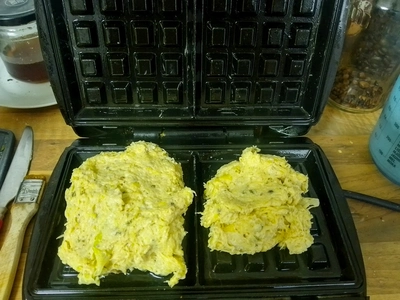

Kartoffelpuffer zählt zu einem meiner favorisierten und einfachen Speisen. Zum Beispiel mit Schmand und veganer Buttermilch. Aber was, wenn ich keine Pfanne gerade zur Handhabe? Also so ein Waffeleisen macht ja auch nichts anderes wie eine Pfanne, nur halt ohne Wenden.
<!-- more -->

Für zwei herzhafte Kartoffelwaffeln benötigen wir:

# Zutaten
* 200 Gramm Kartoffeln
* 100 Gramm Weizenmehl
* Zwei Knoblauchzehen
* Prise Salz
* Eine Schalotte
* Pfeffer
* Rosmarin
* Kümmel

||||
:----:|:----:|:----:
||

Die Kartoffeln schälen wir und ganz fein gerieben. Dazu reiben wir die Schalotte und den Knoblauch und geben die Gewürze dazu. Alle Zutaten werden ordentlich verknetet. 
Die Kartoffeln und die Zwiebel sollten ausreichen Flüssigkeit für den Teig abgeben.

Während wir kneten, können wir das Waffeleisen vorheizen und sobald dieses Heiß ist, ölen wir es ordentlich ein, damit die Waffeln nicht an pappen. 
Nun teilen wir den Teig in zwei Hälfen und geben je Waffeleisenseite den Teig darauf. Waffeleisen zu und ordentlich backen lassen.

Als Beilage passen eine Knoblauchtunke aus Joghurt und Knoblauchzehen, [Bärlauchpesto](/articles/barlauch-pesto-2026-04-27/), gekochter Spinat und alles Weitere was Herzhaft ist. 
