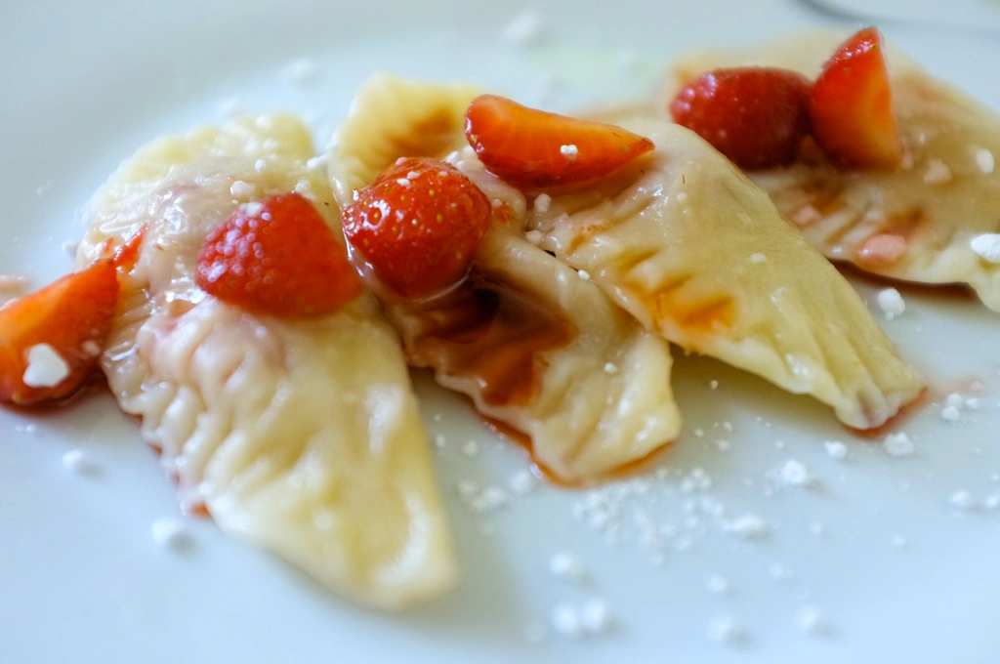
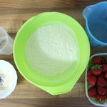
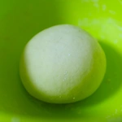
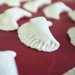
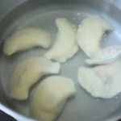
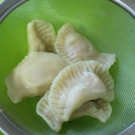
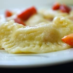

Während das Rezept der ukrainische [Vareniki](#) sehr herzhaft ist, will ich mit dem Rezept für die Pierogi eine sommerliche süße Speise präsentieren. Aus dem Rezept bekommt man etwa 25 Pierogi.

## Zutaten
* 250g Mehl Typ 405
* 250g Erdbeeren
* 150ml heißes Wasser
* Prise Salz
* 2 EL Pflanzen Öl
* Eiersatz für ein Ei (Leinsamen, Eiersatzmischung, ... )
* 2 EL Honigersatz ([LöwenzahnSirup](/articles/loewenzahn-sirup-2019-04-22), Agavendicksaft, ...)

Siebt das Mehl und mischt das Salz hinzu. Gebt nun dem Eiersatz und Öl hinzu, vermischt den Teig und gießt langsam das Wasser dazu. Nun knetet den Teig zehn Minuten mit der Hand und lasst den Teig für dreißig Minuten ruhen. Währenddessen könnt ihr die Erdbeeren waschen und vierteln. Gebt zwei Löffel Honigersatz hinzu und rührt dies um. Falls der Honigersatz zu fest ist, vermischt dies mit einem Teelöffel heißen Wasser. Wir benötigen noch einen Topf mit kochenden Wasser und Salz, im welchen die Piergoi nachher gekocht werden.

||||
:----:|:----:|:----:
||

Nachdem der Teig dreißig Minuten gegangen war, kann dieser ausgerollt und mit einem Glas ausgestochen werden. Auf den Teig werden je nach Größe in die Mitte eine oder zwei Erdbeeren platziert und zusammengeklappt. Mit einer Gabel kann der Teig am Rand zusammengedrückt werden.

||||
:----:|:----:|:----:
||

Legt die Pierogi ins kochende Wasser, bis diese oben schwimmen. Diese müssen nicht sofort raus und können für wenige Minuten oben schwimmen. Nehmt diese dann vorsichtig aus dem kochenden Wasser heraus und legt sie für wenige Minuten zum Abtropfen in ein Sieb.

|||
:----:|:----:
|

Falls noch Erdbeeren übrig sind, könnt ihr diese pürieren und mit etwas Puderzucker andicken, welche als Soße über die Pierogi gegossen werden kann. Streut noch etwas Puderzucker über die Pierogi. Nun könnt ihr die Pierogi genießen.

Smacznego (Guten Apetit).

|||||
:----:|:----:|:----:|:----:
|||

*Natürlich kann man die Pierogi mit anderen Zutaten füllen. Hack, Stampfkartoffel, Pilzen oder was das Herz begehrt. Wenn die herzhafte Variante gewählt wird, lohnt es sich die Pierogi in Fett anzubraten.*
