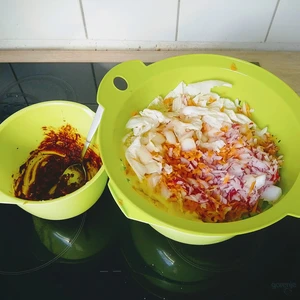

Kimchi ist in der koreanischen Küche aus Kohl und Rettich, welch durch Fermentation zubereitet wird. 
Dieses Rezept ist die eingedeutschte Variante mit Radieschen, Chinakohl, Zwiebel und Sojasoße.

<!-- more -->

# Zutaten Gemüse
* Chinakohl
* Ein Bund Radieschen
* 200 Gramm Möhren
* 200 Gramm Zwiebel
* 35 Gramm Salz

# Zutaten Chilipaste
* 3 Zehen Knoblauch
* 1 Daumen Ingwer
* 2 Esslöffel Chilipulver
* 2 Esslöffel Zucker
* 2 Esslöffel Sojasoße (besser vegane Fischsoße)

Die Chinakohl Blätter werden abgezogen und der Strunk herausgeschnitten. Die Blätter werden in vier bis fünf Teile geschnitten und in eine Schüssel gegeben.
Hinzu kommen klein geriebene Radieschen und Möhren, so wie gehackte Zwiebel, welche dann mit Salz bestreut werden und dieses ins Gemüse einmassiert wird.
Füllt das Gemüse in ein Sieb um und lasst dieses für mindestens 15 Minuten ziehen und dabei abtropfen lassen.

Den Knoblauch schneiden wir klein, genau wie den Ingwer und zermahlt diese in einem Mörser. Gebt das Chilipulver, Zucker sowie die Sojasoße bzw. vegane Fischsoße hinzu. Vermischt das ganze miteinander und bestreicht den Chinakohl damit.

Das Gemüse in die Gläser füllen und darauf achten, dass alles dicht geschichtet ist und wenig Luft im Glas bleibt. Die Gläser verschließen und für mindestens fünf Tage stehen lassen, damit das Kimchi fermentieren kann. 

