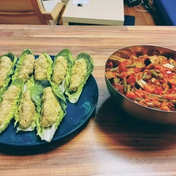

Aktuell bin ich auf den Geschmack von Köfte mit gebratenen Gemüse gekommen. Besonders, weil es nicht schwer zum Zubereiten ist und das Gemüse und die Köfte parallel bearbeitet werden können.
<!-- more -->

Auch wenn es auf den ersten Blick nach viel klingt, ist die Arbeit hierzu doch sehr einfach.

# Zutaten Köfte
* 1/2 Tasse rote Linsen
* 1/2 Bulgur Tasse (alternativ Couscous oder Reis)
* etwas Lauch
* Prise Salz
* etwas Pfeffer
* etwas Kümmel
* 1 1/2 Tassen Wasser
* 1 EL Tomatenmark

# Gemüse in Tomatenmarinade
* 300 g rote Paprika
* 6 Champignons (optional)
* 350 g Räucher Tofu
* 2 Chilischoten
* 2 Zwiebel
* 4 Zehen Knoblauch
* 1 Möhre
* 1 blanchierte Tomate
* 70 g Tomatenmark
* 250 g Stangenbohnen
* etwas geriebener Ingwer zum Anbraten
* Zucker zum Karamellisieren
* 1 TL Paprikapulver
* Eine Prise Salz
* Etwas Pfeffer
* etwas Kala Namak

Für die Vorbereitung werden die Zwiebel, Ingwer und Knoblauch klein gerieben. Die Paprika wird in grobe Würfel geschnitten. Die Bohnen (alternativ gehen auch Prinzessbohnen) sollten an den Enden beschnitten und dann in grobe Scheiben geschnitten werden. Danach vierteln wir die Möhre und die Tomate wird mit einem Kreuz angeschnitten, wodurch beim blanchieren die Haut leichter abgezogen werden kann. 
Wir hacken noch etwas Schnittlauch, welcher zum Schluss zu den Köfte hinzukommen. Den Räucher Tofu würfeln wir ebenfalls. Nun können wir die Bohnen entweder in einem Bambuskorb gedämpft, oder im Topf gekocht, bis diese ein schönes Grün erhalten. Ich bevorzuge den Bambuskorb, da ich im kochenden Wasser die Tomate blanchieren kann. Die roten Linsen lassen wir in einem Topf bei kochenden Wasser quellen. 

Während die Linsen im Topf quellen und die Bohnen gedämpft oder gekocht werden, bringen wir eine große (Wok)Pfanne mit etwas pflanzen Öl auf Temperatur. Darin braten wir kurz den klein gerieben Ingwer an. Wenn dieser langsam braun wird, bringen wir die Zwiebel hinzu und lassen diese kurz mit anbraten. Jetzt streuen wir etwas Zucker darüber, wodurch die Zwiebel karamellisiert werden. Sobald die Zwiebel Farbe bekommen haben, legen wir die Chilis mit dem Räuchertofu hinzu. 

Nach wenigen Minuten kommen die Paprika Würfel, die blanchierte Tomate, welche wir grob würfeln, Karotten und die Bohnen in die Pfanne. Das ganze braten wir jetzt für weitere fünf Minuten, bevor wir Knoblauch und Tomatenmark hinzugegeben, das Ganze wird vermischt und die Flamme auf eine kleine Stufe heruntergestellt und für 30 Minuten geköchelt. 

Die roten Linsen sollten in der Zwischenzeit auch fertig sein. Zu erkennen, dass diese ihre rote Farbe verloren haben. Wir nehmen den Topf vom Herd und geben eine halbe Tasse Bulgur, Couscous oder Reis hinzu, vermischen das ganze und legen ebenfalls für 30 Minuten einen Deckel darauf, damit es quellen und abkühlen kann, bevor wir Salz, Pfeffer, Lauch, Kümmel, Paprikapulver und ein Esslöffel Tomatenmark hinzugeben und es verkenten.

Aus den Linsen und Bulgur formen wir Bällchen oder Röllchen, die wir auf dem Romansalat Blättern servieren. Dazu kommt das Gemüse aus der Pfanne.

