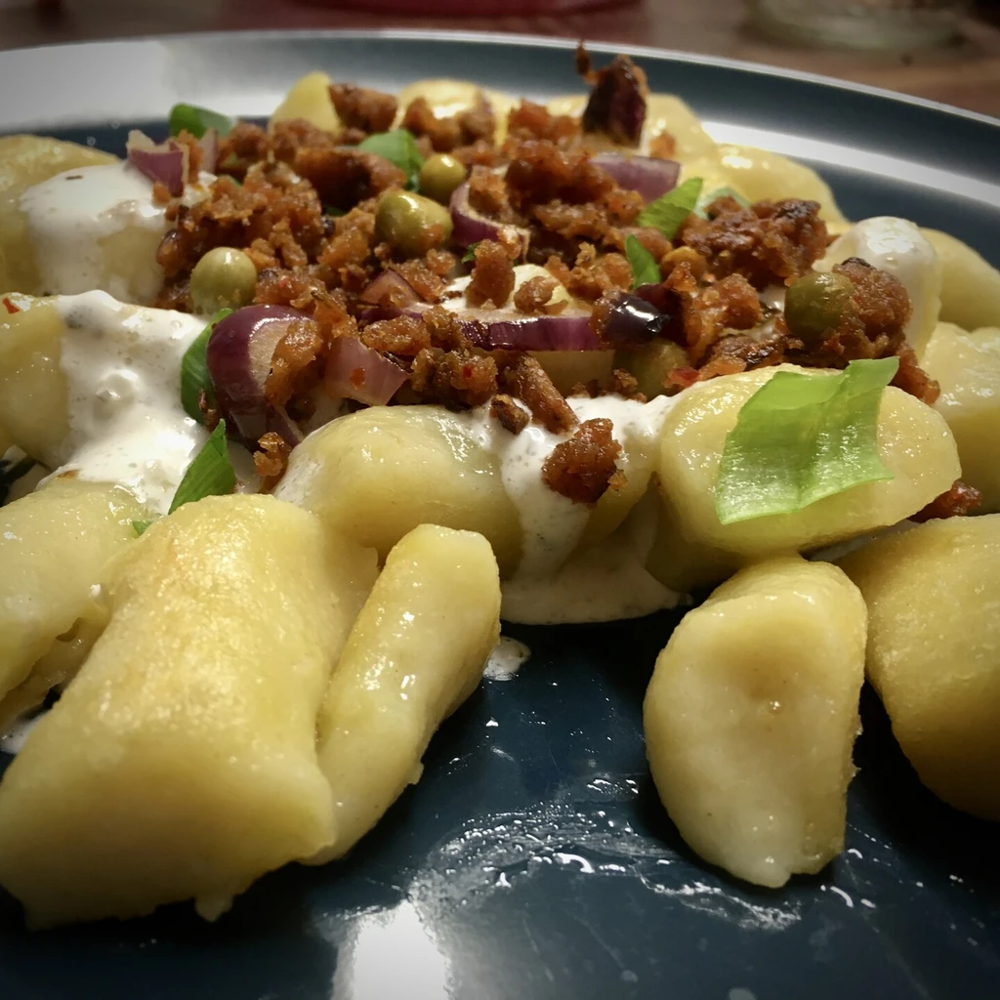
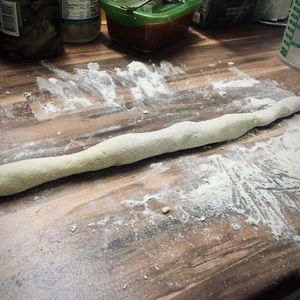
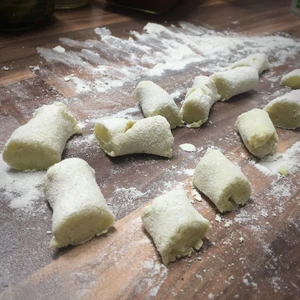
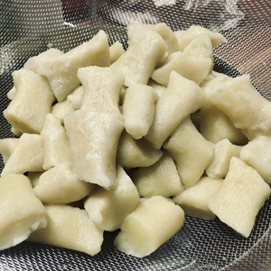
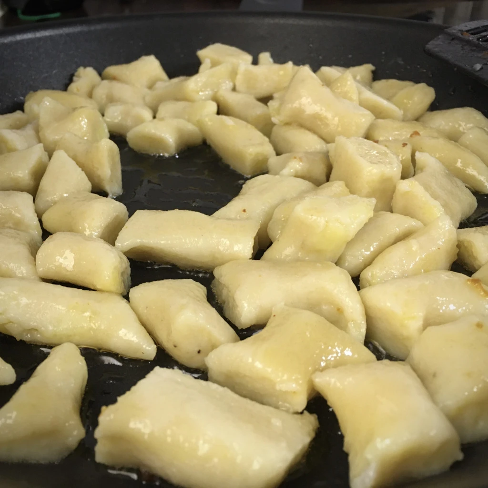
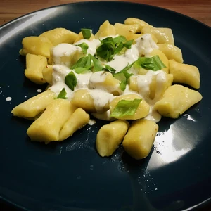
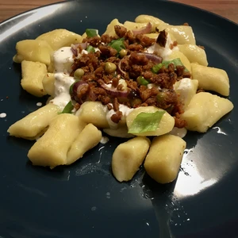

Bei Koptyka handelt es sich um traditionelle polnische Klöße. Hergestellt werden sie aus einer Mischung aus gekochten Kartoffeln und Mehl. Koptyka kann herzhaft als Hauptgang zubereitet werden oder auch als Süßspeise mit Zucker und Zimt. Die Zubereitung der Koptyka ist sehr einfach.
<!-- more -->

## Zutaten

* 150 Gram Mehl (Typ 405)
* 400 Gram Kartoffel
* 25ml Wasser
* Öl zum Anbraten
* Hack (zum Beispiel [Haferhack](articles/hafer-hack-2022-09-12/))
* Zwiebel
* Schmand oder vegane Creme mit Öl und Apfelessig
* Basilikum Blätter (Optional)

Schält die Kartoffel und legt diese in kochendes Wasser, bis diese Durch sind. Sobald diese gekocht sind, zerstampft die Kartoffel bis keine festen Stücke bestehen. Gebt dann das Mehl hinzu und verknetet den Teig. Das Wasser wird während des Knetens nach und nach hinzugegeben. Rollt den Teig auf einer bemehlten Oberfläche aus und schneidet kleine Stücke ab, welche dann in kochendes Wasser mit Salz gelegt werden.

||||
:----:|:----:|:---:
||

Sobald die Klöße im kochenden Wasser oben schwimmen, sind diese fertig und können vorsichtig herausgefischt und in ein Sieb gelegt werden, damit diese abtropfen können.

Nun kann die auch die Beigabe für die Koptyka vorbereitet werden. Hierzu habe ich [Haferhack](articles/hafer-hack-2022-09-12/) genutzt, weshalb auch grüne Erbsen auf dem Bild zu sehen sind. Dieses habe ich in einer Pfanne mit Zwiebeln angebraten und gewürzt. Parallel hierzu wurden die Koptyka in heißen Öl angebraten. Als Soße nutzte ich vegane Creme, zum Beispiel jene von DrOetker. Hinzu gab ich etwas Olivenöl und Apfelessig, sowie Wasser und Kräuter.

Die Koptyka können serviert werden, sobald diese eine goldene Farbe erhalten haben. Gebt danach das Schmand über die Knödel sowie das Hack.

|||
:----:|:----:
|
