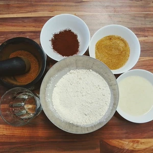
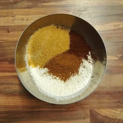
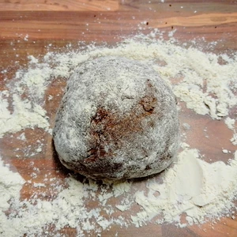
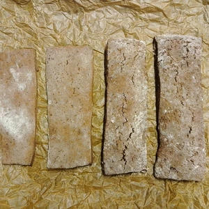
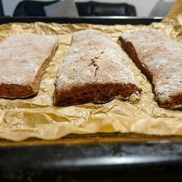
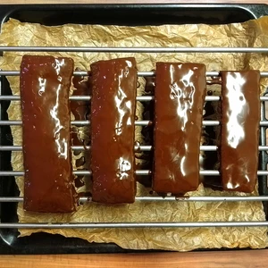
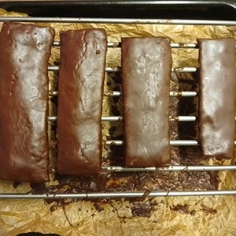
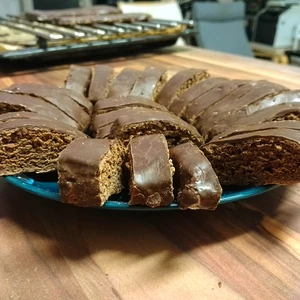

Die Weihnachtszeit ist da und besonders über das Gebäck erfreue ich mich. LebKuchenherzen und Spekulatius gibt es seit September, 
aber der Zauber im Gaumen wird umso mehr entfacht, wenn es draußen frostig ist.

<!-- more -->

Dieses Rezept ist tatsächlich sehr einfach und schnell zubereitet. 

# Zutaten LebKuchengewürz
* 4 TL Zimt
* 1 TL Piment
* 1 TL Anis
* 1 TL Ingwer
* 1 TL Muskatnuss
* 1 TL Karadom
* 1 TL Koriander
* 1 TL Nelken

# Zutaten Teig
* 1 gestrichener TL Backpulver
* 120 g Rohrzucker
* 300 g Dinkelmehl (alternativ auch Weizenmehl)
* 15 g Backkakao
* 25ml Pflanzenöl
* 150ml Pflanzenmilch (zum Beispiel [Hafermilch](/articles/hafermilch-2022-01-29/) oder [Sojamilch](/articles/soja-milch-2023-02-04/))

# Schokoladenguss
* 180g Zartbitter oder dunkle Schokolade
* 1 1/2 bis 2 TL Kokosöl

Das LebKuchengewürz schmeckt intensiver, wenn die Gewürze frisch im Mörser gemahlen werden.
Siebt das Mehl in eine Schüssel und gebt dan Zucker und Backpulver dazu. Danach folgen die Gewürze und den Backkakao. Vermischt alle Zutaten und gebt nach und nach Öl und Pflanzenmilch zum Teig. Verknetet den Teig, bis der Teig eine feste Masse ergibt.

||||
:----:|:----:|:----:
|

Dann wird der Teig auf einer bemehlten Oberfläche ausgerollt, wobei der Teig nicht dünner als 3 cm werden darf, da beim Ausbacken dieser sehr knusprig wird.
Schneidet große Rechtecke aus dem Teig, oder alternativ stecht mittels Formen Plätzchen heraus.

||||
:----:|:----:|:----:
|

Wärmt den Ofen auf 180 Grad vor und backt den Teig für 15 Minuten bei Umluft.
Lasst den Teig abkühlen und bereitet dann den Schokoladenguss vor. 
Gebt die Schokolade in eine Schüssel und legt diese in ein Wasserbad. Sobald die Schokolade geschmolzen ist, rührt das Kokosöl unter.

||||
:----:|:----:|:----:
|

Bestreicht den LebKuchen mit der Schokolade oder tunkt die Kekse in die Schokolade und lasst die Schokolade trocknen und härten.

