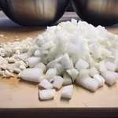
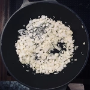

Dieses ungarische Schmorgericht, ist in Osteuropa verbreitet und zählt zumindest bei uns, zu einem Standardgericht. Durch die Tomaten und Paprika kommt ein fruchtiger Geschmack und durch die Gewürze bekommt das Leczo seine Schärfe, welche man abstimmen kann. Durch die Zugabe von zum Beispiel geräucherten Tofu, erhält man ebenso eine gute Rauchnote.

<!-- more -->

Dieses Rezept (meine persönliche Abwandlung) ist für vier Portionen ausgelegt und nimmt etwa eine halbe Stunde Aufwand, sowie eine Stunde Wartezeit in Anspruch. Während des köcheln kann dann auch Reis, Brot oder Kartoffelpuffer zubereitet werden. Hierzu später mehr.

|         |         |
:-------:|:-------:
|         

## Die Zutaten
* eine Rote, Gelbe und Grüne Paprika (insgesamt 500g)
* 500g Tomaten
* 150ml Wasser
* 2 TL Paprikapulver (Edelsüß oder Scharf)
* 1 TL gemahlenes Chili (Optional)
* 1 Prise Salz
* etwas Pfeffer
* 1 TL Braunen Zucker
* 3 Speisezwiebel
* 3 bis 4 Knoblauchzehen
* Margarine zum Anbraten
* 1 EL Tomatenmark
* 1 Möhre (Optional)
* Räucher Tofu (Optional)

|                                        |                                        |                                    | |
:-----------------------------------------:|:-----------------------------------------:|:----------------------------------------:|:-------------------------:
 |  |  |  |

Die Paprika werden in grobe Würfel geschnitten, die Tomaten blanchiert ihr und schneidet ebenfalls in grobe Würfel, nachdem ihr die Haut abgezogen habt. Zum Schluss werden noch Zwiebel und Knoblauch klein gehackt und die Möhre klein gerieben.

Wir benötigen dann einen großen Topf, in dem wir die Margarine zum Anbraten der Zwiebel und Knoblauch geben. Sobald die Zwiebel glasig sind, geben wir den Zucker darüber und lassen das ganze karamellisieren.

Dieser Prozess kann aber auch übersprungen werden, sollte man aus Gründen auf den zusätzlichen Zucker verzichten wollen. Wer Räucher Tofu dabei haben möchte, gibt diesen in kleinen Würfel hinzu, sobald die Zwiebel eine angenehme Bräune erhalten haben und brät diese für fünf Minuten mit an. Danach gebt ihr die Paprika, Tomaten, die geriebene Möhre sowie das Tomatenmark hinzu und rührt das ganze ordentlich um. Füllt den Topf mit Wasser und würzt das ganze. Nun gilt es zu warten, während das Leczo biz zu einer Stunde vor sich hin köchelt und das Gemüse weich wird.  

|        |        |
:--------:|:------:
|

Als Beigabe zum Leczo kann man unterschiedliches machen. Zu Empfehlen ist Reis, falls es schnell und ohne großen Aufwand geschehen soll. Falls das Leczo ein scharfes werden soll, empfiehlt es sich das Fladenbrot zu machen. Auch gingen Kartoffelpuffer.

Für das Brot benötigt man nicht viel.
* 200g Mehl
* 150ml Wasser
* 1 Prise Salz
* Halbe Packung Backpulver

Alles wird Miteinader vermischt und zu einem Teig geknetet. Der Teig ruht dann für 15 Minuten. Danach können kleine Stücke vom Teig ab gezupft werden und auf einer bemehlten Oberfläche ausgerollt oder mit der Hand zu Fladen gedrückt werden, welche danach in einer heißen Pfanne ohne Öl von beiden Seiten gebacken werden.

Nun kann das Leczo mit dem Brot oder Reis serviert werden.
Lasst es euch schmecken oder wie es auf Polnisch heißt "Smacznego"
