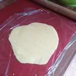

Unter meinen Freunden ist es bekannt, dass ich meine Speisen gerne nach mexikanischer Art zubereite. Deshalb ist es nicht verwunderlich, dass ich mich an Tortillas dran machte und weil mein Räucher Tofu kurz vor dem Ablaufen war, entschloss ich mich für die Maisfladen-Sandwiches. Da für die Füllung das Tofu entsprechend in einer Marinade ziehen muss, erfordert dies etwas Vorbereitungszeit.

Für die Zubereitung von 4 bis 6 Portionen (je nach Größe der Tortillas) benötigen wir drei Rezepte. Die Tortillas, die Füllung und optional die Käsesoße.

## Tortillas

- 200g Masa Harina (mit Kalkwasser bearbeiteter Mais Mehl)
- Prise Salz
- 200ml warmes Wasser

Salz und Mehl werden vermengt und mit dem Wasser zu einem glatten Teig geknetet. Danach lässt man diesen für wenige Minuten stehen. Das schwierigste ist es die Fladen unbeschadet in eine heiße Pfanne (ohne Öl) zu bekommen. Deshalb heizt als Vorbereitung schon mal die Pfanne auf mittlere Stufe auf. Nehmt etwas vom Teig und formt eine glatte Kugel. Diese legt ihr entweder auf eine Frischhaltefolie oder eine leicht angefettete glatte Oberfläche, wie zum Beispiel einem Brett. Nun kann der Teig entsprechend ausgerollt oder platt gedrückt werden.

|||
:----:|:----:
|

Zieht den Teig vorsichtig von der Oberfläche und legt diesen in die heiße Pfanne zum Rösten. Nach nur wenigen Augenblicken sind die Fladen bereit zum Wenden. Wenn die Fladen zu lange in der Pfanne sind, werden diese trocken und reißen.

Die Fladen sollten noch warm verzehrt werden, alternativ legt ein Küchentuch über die fertigen Fladen, bevor diese befüllt werden können, damit diese nicht austrocknen und reißen.

## Tofu Füllung und Marinade

- Block Räucher Tofu
- 100ml Wasser
- Eine Tomate
- 2 TL Paprika Pulver
- 1 TL Curry
- 1 Prise Salz
- etwas Pfeffer
- 1 TL Knoblauch Granulat
- 1 TL Honigersatz (Agaven Dicksaft, Löwenzahn-Sirup, ..)
- 1 EL Tomatenmark
- 1 EL Oliven Öl
- 1 kleine Zwiebel.

Den Räucher Tofu reiben oder schneiden wir den geräucherten Rand herunter, so das wir den Tofu mit einem Sparschäler in dünne Streifen schneiden können und den Rand weiter verarbeiten. Die Zwiebel wird kleingehackt und mit dem Tofu in ein Behälter gelegt. Der Rand vom Tofu wird mit den anderen Zutaten in einem Stand oder Stabmixer zur Marinade gemischt und über das Tofu und die Zwiebel gegossen. Alles gut verrühren oder schütteln. Der Geschmack zieht mehr ins Tofu ein, je länger es steht.

|||||
:----:|:----:|:----:|:----:
|||

Trennt grob den Tofu von der Marinade (zum Beispiel durch ein Sieb). Die Tofu streifen können wir nun entweder in einer Pfanne anbraten oder in eine Auflaufform legen und diese bei 220 Grad Ober- und Unterhitze in den Ofen stellen, bis dieser eine schöne Farbe erhält.

|||
:----:|:----:
|

## Käsesoße

Die Käsesoße ist Optional. Man kann auch einfach geriebenen Schmelz darüber streuen, aber ich persönlich bevorzuge die geschmolzene Variante. Hierzu nimmt man etwa 125ml Hafer-Kochcreme und lässt die in einer kleinen Pfanne leicht ankochen. Dann gibt man etwas geriebenen Schmelz hinzu und würzt dies mit Thymian, schlagt die Soße mit einem Schneebesen. Sollte es zu flüssig oder nicht käsig genug sein, gebt etwas vom geriebenen Schmelz hinzu. Sollte die Soße zu fest sein, kann diese mit etwas [Hafermilch](//articles/hafermilch-2022-01-29) gestreckt werden.

Endlich könnt ihr die Fladen befüllen. Ich habe meine mit Salat, Tomaten, Gurken, Möhren, veganen Feta, Lauch und dem Tofu befüllt. Darüber gab ich eine Scharfe sowie die Käsesoße.

|||||
:----:|:----:|:----:|:----:
||
