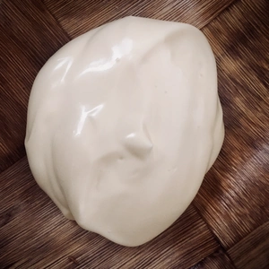

Mayonnaise selber zu machen ist sehr einfach und geht auch schnell. Für die Zubereitung wird nur Sojamilch, pflanzliches Öl, Senf, Salz und Essg benötigt.
Geschmacklich steht es der Mayonnaise im Geschäft nichts nach
<!-- more -->

# Zutaten
* 200ml [Sojamilch](articles/Soja_Milch-2023-02-04/)
* 1 TL Senf
* 1/2 TL Salz
* 400ml pflanzliches Öl
* 1 EL Essig

Sojamilch mit Senf, Salz und Essig mit einem (Stab)Mixer vermischen und dabei langsam das Öl hinzugeben. 
Dabei wird alles weiter gemischt, bis eine cremig-feste Substanz entsteht. 

Falls eine Variante als Remouladen gewünscht ist, müssen nur kleingehackte Zwiebel und eingelegte Gurken hinzugegeben werden.

Auch für Aioli kann dieses Basisrezept genutzt werden. Hierzu müssen Knoblauchzehen untergemischt werden und als Öl nehmt ihr Olivenöl.

