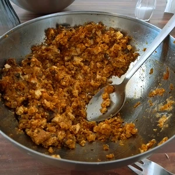

Polnische Pierogi lassen sich zwar recht simpel veganisieren, aber das wäre etwas zu einfach. Ich habe diese ebenso mit der, von uns bezeichneten, mediterraner Küche gekreuzt und was soll ich sagen, ich bin davon sehr begeistert.
<!-- more -->

Für die mediterrane Pierogi benötigen wir eine fruchtige Tomatensoße, die mit Paprika verfeinert wird, sowie Teig für die Taschen und Füllung. Wir beginnen mit der Soße, da diese langsam vor sich her köcheln kann.

# Zutaten Soße
* 1 rote Paprika
* 1 Fleischtomate (oder 200 g Cherry Tomaten)
* 1 rote Zwiebel
* 4 Zehen Knoblauch
* 1 Möhre
* Olivenöl zum Anbraten
* Hand voll Radieschenblätter oder Spinat
* 100 g Tomatenmark
* Balsamico zum Löschen
* 250ml Wasser
* 1 EL [Honig](/articles/loewenzahn-sirup-2019-04-22/)
* Salz
* Thymian
* Oregano
* Basilikum

# Zutaten Teig
* 250 g Mehl
* 150ml Wasser
* 1 gestrichener Teelöffel Salz

# Zutaten Füllung
* 80 g veganer Feta
* 200 g Natur Tofu
* 150 g veganes Hack ([Hafer Hack](/articles/hafer-hack-2022-09-12/),[Okara](/articles/okara-2023-02-04/)) 
* 100 g Champignons

Für die Soße müssen wir die Zwiebel klein reiben, da wir den Saft und Stückchen in dem Olivenöl hinein bringen wollen, mit dem wir das Gemüse anbraten. Die Fleischtomate wird in einem Topf mit kochenden Wasser gelegt, damit wir diese blanchieren. Solltet ihr euch für Cherry Tomaten entschieden haben, schneidet ein Kreuz in diese ein, bevor die ins kochende Wasser gelegt werden. Die Möhre wird ebenso klein gerieben. Die Blätter der Radieschen werden ordentlich gewaschen, da diese gern noch Erdreste beinhalten, danach werden diese klein gehackt. Ebenso muss die Paprika kleingehackt werden.
In einem Mittelgroßen aber tiefen Topf erhitzen wir das Olivenöl und mischen dann die Zwiebel hinzu. Diese werden kurz angebraten, damit die nicht dunkel werden und geben einen Esslöffel Honig dazu. Nachdem die Zwiebel und der Honig sich mit dem Öl vermischt hatte, braten wir darin die Paprika und Möhre an. Währenddessen kann die Fleischtomate aus dem Topf herausgezogen und mit kalten Wasser abgeschreckt werden, damit wir die Haut abpellen können. Danach wird diese grob gehackt. Bei den Cherrytomaten werden diese nur halbiert. Die Tomatenwürfel kommen nun zu der Paprika und der Möhre. Mischt jetzt das Tomatenmark hinzu und verführt das ordentlich, damit sich diese auf den gesamten Inhalt verteilt. Löscht dann das ganze mit dem Balsamico und füllt den Topf mit Wasser auf, presst dann den Knoblauch in die Soße. Verrührt alles ordentlich, stellt die Hitze auf eine kleine Stufe, damit die Soße indessen vor sich her köcheln kann. Die restlichen Zutaten folgen später.

Weiter geht es mit der Füllung. Die Champignons werden klein gehackt und das Hack regulär in Öl angebraten. Würzt es eventuell noch nach Bedarf. Kurz bevor das Hack fertig ist, gebt ihr die Pilze hinzu und bratet diese kurzweilig mit an. Stellt dann die Pfanne zur Seite. Den Natur Tofu pressen wir die restliche Flüssigkeit aus, in dem wir dieses auf ein Tuch legen und ein schweres Gewicht darauf. Danach wird der Tofu Block zerbröselt. Den veganen Feta reiben wir hinzu und zum Schluss geben wir das Hack mit den Pilzen dazu. Die Füllung wird nun mit den Händen verknetet. 

Der Teig ist sehr simpel. Die Zutaten werden zusammen gemischt und mit den Händen ca. 10 Minuten verknetet. Dieser darf nicht zu trocken sein, da dieser sonst bröselt. Auf einer bemehlten Oberfläche rollen wir den Teig jetzt aus, nicht zu dünn, da dieser sonst im Topf aufgeht oder platzt. Mit einem Glas stechen wir jetzt die Teigtaschen aus. Damit die nicht mit der Arbeitsfläche verkleben oder mit aneinander pappen, sorgt dafür, dass diese leicht bemehlt sind. Wiederholt das so lange, bis der Teig aufgebraucht ist. 

In die Mitte der Teigtasche kommt ein Esslöffel der Füllung. Je nach Größe des Glases zum Ausstechen, kann es mehr oder weniger sein. Wenn ihr nun den Teig in der Mitte faltet, sodass sich die Ränder berühren und zusammen gepresst werden, könnt ihr erahnen, wie viel Füllung okay ist. Gebt nicht zu viel rein, da die Pierogi sonst im Wasserbad aufplatzen. Dies wiederholt ihr so lange, bis der Teig und/oder Füllung verbraucht ist.

Nun muss in einem großen Topf Wasser mit einem Esslöffel Salz zum Kochen gebracht werden, in welchen die Pierogi hinein gelegt werden. Das Bad dauert nicht lange und ihr erkennt, dass diese fertig sind, wenn die oben schwimmen. Währenddessen pürieren wir die Soße mit einem Stabmixer und geben die gehackten Radieschenblätter oder Spintat in die Soße, sowie Salz, Thymian, Oregano und Basilikum. Sollte die Soße zu dick sein, bisschen Wasser hinzugeben. 

Ihr könnt jetzt die Pierogi mit der Soße servieren.

Tipp: Pierogi schmecken am nächsten Tag besser, wenn diese in Margarine angebraten werden.

  
