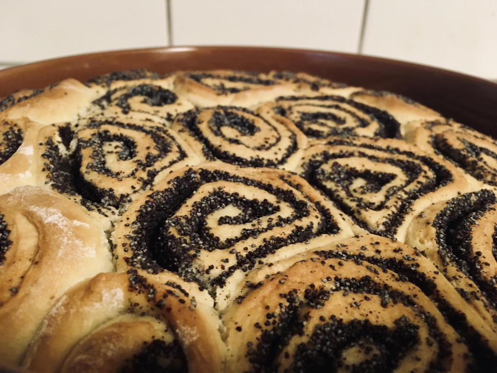
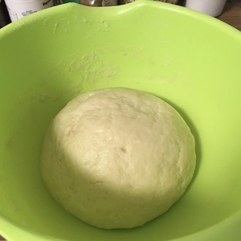
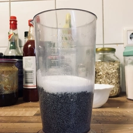
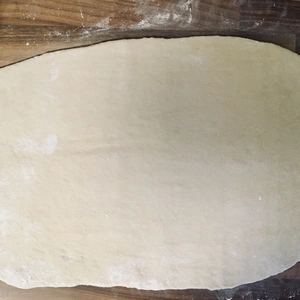
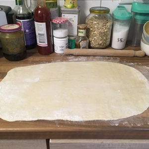
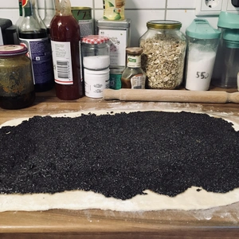
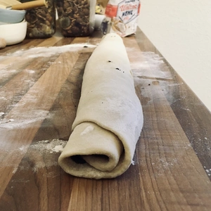
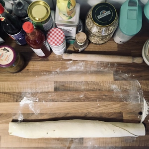
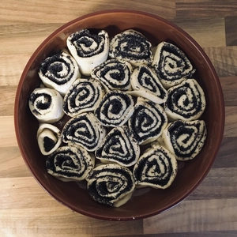
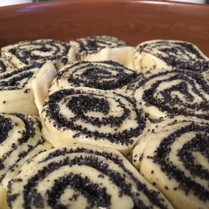

Zu unserem letzten Spieleabend hatte ich eine Überraschung im Gepäck, und zwar habe ich Mohnschnecken gemacht. Diese zeichneten sich nicht nur davon aus, dass der Teig luftig wurde, sondern durch Mohn und Süße auch schmackhaft. Leider musste ich die Schnecken für den Transport bereits auseinander nehmen, weshalb die beteiligten am Spieleabend nicht die runde Form vernehmen konnten.

Vorweg, die Zubereitung nimmt etwas Zeit in Anspruch, aber es lohnt sich.

<!-- more -->

# Zutaten Teig
* 400g Weizenmehl
* 1 pkg. Trocken Hefe
* 80 g Zucker
* ½ TL Salz
* 200ml vegane Milch (zum Beispiel [Hafermilch](/articles/hafermilch-2022-01-29/)
* 1 EL pflanzliche Margarine

# Zutaten Füllung
* 180g Mohn
* 150ml vegane Milch (zum Beispiel [Hafermilch](/articles/hafermilch-2022-01-29/)
* 50g Zucker

Mischt für den Teig Hefe und Milch zusammen, sodass keine Klümpchen mehr vorhanden sind. Die Milch sollte Zimmertemperatur haben. Das Mehl wird mit dem Zucker und Salz vermischt. Die Margarine sollte nicht allzu fest sein, sodass sich diese mit dem Teig verkneten lässt. Gebt nun die Milch mit der Hefe zum Mehl und der Margarine hinzu und knetet den Teig für mindestens zehn Minuten, sodass eine glatte Kugel entsteht.

||||
:----:|:----:|:----:
|||

Der Teig soll dann unter einem feuchten Küchentuch für mindestens eine Stunde in einem warmen Ort gehen. Der Teig darf auch länger stehen gelassen werden.

Nun können wir uns der Füllung widmen, die schnell zubereitet wird.
Hierfür habe ich Mohn und Zucker mit einem Stabmixer klein Wenig zerkleinert. Die Milch wurde auf kleiner Flamme erhitzt und Mohn mit Zucker hinzu gerührt. Das Ganze wird für einige Minuten eingekocht, sodass eine feine Masse entsteht, die auf den Teig verteilt werden kann. Zur Not kann auch die Flüssigkeit durch ein Sieb getrennt werden, sollte die Masse noch zu feucht sein.

||||
:----:|:----:|:----:
||

Während der Mohn einkocht, kann der Teig rechteckig und dünn ausgerollt werden und danach mit dem Mohn bestrichen werden.

Rollt nun den Teig zusammen und schneidet etwa drei Zentimeter dicke Scheiben ab. Diese kommen in eine Auflaufform. Wenn ihr Platz zwischen den Schnecken lässt, fusionieren diese nicht. Ich habe mich für meine Runde Auflaufform entschieden und eng bestückt, sodass es mehr einem Kuchen gleicht.

|||||
:----:|:----:|:----:|:----:
|||

Zum Schluss werden die Schnecken mit etwas Wasser bespritzt und für 25 Minuten in einen vorgeheizten Ofen bei 180 Grad Ober- und Unterhitze geschoben. Sobald der Teig Goldbraun ist, sind die Schnecken fertig.
