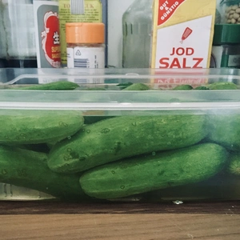
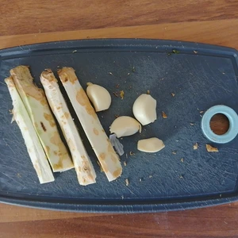
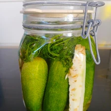

Wie es bei den anderen Familien in Polen aussieht, weiß ich nicht, aber bei uns wurden Gurken immer eingelegt. Somit bin ich damit aufgewachsen, eine Gurke immer zwischendurch zu snacken oder zu fast allem essen. Auch wurden die Gurken zu Suppen verarbeitet. Im Grunde würde ich polnische Salzgurken als Grundnahrungsmittel bezeichnen.

<!-- more -->

Zum Einlegen der Gurken wird nicht viel benötigt.

# Zutaten
- 500ml Wasser
- 1 EL Salz

- 5 (oder mehr Gurken, je nach Größe)
- Dill mit Blüten
- 4 Knoblauchzehen
- 2 Finger große Meerrettichstreifen

Die Gurken müssen vorher gewaschen werden, ich lasse die auch gerne über Nacht in kalten Wasser liegen, bevor ich diese einlege. 
Der Meerrettich muss geschält und in Finger große Streifen geschnitten werden. Zu meist reicht es, wenn der Meerrettich halbiert und dann auf die Länge geviertelt wird.
Wascht das Glas zum Einmachen mit heißen Wasser aus, damit sich keine Keime bilden.

Legt die Gurken, die Knoblauchzehen und den Meerrettich gut verteilt ins Glas.
Nun muss nur noch ein Esslöffel Salz in 500ml heißem Wasser aufgelöst werden, bevor ihr dieses ins Glas schüttelt.
Verschließt das Glas und stellt es für die nächsten vier Tage auf mehrere Lagen Zeitungspapier oder Pappe, damit ggfs. entweichende Flüssigkeit sich nicht auf dem Boden oder Regal sammeln wird. Nach vier Tagen sind die Gurken bereits genießbar, jedoch bevorzuge ich persönlich länger zu warten, beziehungsweise ich mache so viele Gläser, dass die Gurken so schon länger stehen werden. Hierdurch wird der Geschmack intensiver.
Dass die Gurken ordentlich an Geschmack gezogen haben, erkennt ihr daran, dass der Grünton der Gurken sich verändert hat.

