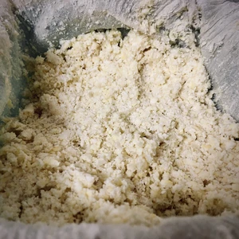
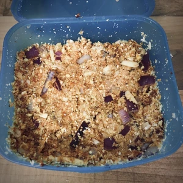

Bei Okara handelt es sich um die Reste, welche bei der [Sojamilch](/articles/soja-milch-2023-02-04/)produktion entsteht. 
Die pürierte Sojabohnen lassen sich mit Gewürzen verfeinern und zu Hackbällchen, Frikadellen und Nuggets verarbeiten.

<!--  more -->

* Okara (aus 100g Sojabohnen)
* 1 Tl BBQ Gewürz
* 1 TL Honig Ersatz
* 1 EL Tomaten Mark
* 1 EL Soja Soße
* 1/2 Zwiebel
* 1 Knoblauchzehen

* Haferflocken oder Paniermehl (Optional)
* 4 EL Stärke + 6 EL Wasser verrühren am nächsten Tag als Eiersatz und dazu mischen

|||
:---:|:---:
|

Alle Zutaten, bis auf die Haferflocken, werden miteinander zu einer Masse vermengt. Die Gewürze können variiert werden und müssen nicht genau wie im Rezept angewendet werden. Damit der Geschmack intensiver wird, lasse ich die Masse für mindestens einen Tag ziehen, bevor ich diese weiter verarbeite.

Am Folgetag werden aus der Masse entsprechend Frikadellen, Nuggets oder Bällchen geformt. Für eine knusprige Kruste wird das Okara in dem Eiersatz getunkt und in Paniermehl oder Haferflocken gewälzt.

Dann ist das Okara bereits fertig in einer Pfanne oder Topf mit heißem Öl angebraten oder frittiert zu werden.

