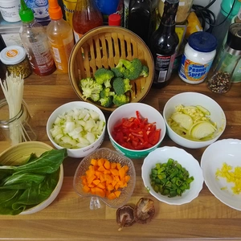
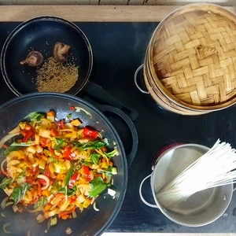
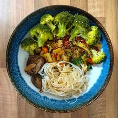
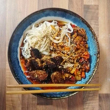

Die Tage hatte ich Phở Chay Suppe gemacht und weil ich noch reichlich Gemüse übrig hatte, dachte ich anstelle einer weiteren Suppe, bereite ich eine Gemüsepfanne zu.
Dabei ist dieses Rezept zur Suppe der ähnlich.
<!-- more -->

# Zutaten
* 250 Gramm Brokkoli
* 1/2 Kohlrabi
* Pak Choy Grün
* Reisnudeln
* Eine Möhre
* Eine rote Spitzpaprika
* 1/4 Bund Lauch
* Eine Zwiebel
* Einen Daumen Dick Ingwer
* drei Knobluachzehen
* eine Chli
* Shitake Pilze
* Sesam
* Salz
* Zwei Esslöffel Sojasoße
* Schuss Zitronensaft
* Ein Esslöffel [No-Fischsoße](/articles/vegane-fischsosse-2025-04-29/)
* [Veganer Honig](/articles/loewenzahn-sirup-2019-04-22/)
* Pflanzenöl
* Ein Esslöffel Tomatenmark

Trennt die Brokolliröschen vom Stängel und das Pok Choy Grün vom Stiel. Den Stängel, Kohlrabi, Paprika und den Stiel vom Pok Choy schneiden wir in Mundgerechte würfel. Ebenso würfeln wir die Möhren, die Zwiebel schneiden wir in halbe Ringe und der Knoblauch sowie der Ingwer werden klein gehackt. Die Chili und den Lauch schneiden wir in Ringe.

Nun braten wir den Ingwer in Öl für drei Minuten an und geben dann die Chilis, Zwiebel und Knoblauch hinzu. Nach Fünf Minuten geben wir die Möhren hinzu und nach weiteren zwei bis drei Minuten kommen Kohlrabi, den Brokkolistängel, Stiel vom Pok Choy und Paprika hinzu, sowie der Esslöffel Tomatenmark mit etwas veganen Honig und vermischen das ganze. Das Gemüse braten wir auf mittlerer Hitze für etwa Zehn Minuten. Umrühren nicht vergessen.
Den Brokkoli dämpfen wir im Bambusorb. Währendessen können wir die Reisnudeln kochen, oder auch alternativ Reis.

Parallel dazu können wir auch die Sojasoße, [No-Fischsoße](/articles/vegane-fischsosse-2025-04-29/) und den Zitronensaft vermischen.

Zum Schluss wird noch das Pak Choy-Grün unter das gebratene Gemüse gehoben, mit Salz gewürzt und Sesam in einer Pfanne ohne Öl kurz angeröstet sowie die Pilze scharf angebraten. Jetzt kann alles zusammen serviert werden. Die Soße gießen wir über die Reisnudeln.

Eine alternative Zubereitung mit Bratlingen in einer Süß-Sauren-Jalapenos-Tomaten Soße

  
