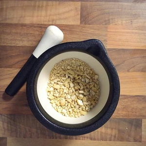

Dieser Paprika Brotaufstrich hat es mir ziemlich angetan, besonders in Kombination mit einem frisch gebackenen Brot. Die Zubereitung ist sehr einfach und ist schnell gemacht.

<!-- more -->

# Zutaten
* Eine rote oder orange Paprika
* 100g Cashew Kerne
* Olivenöl zum Anbraten
* 1 Cocktailtomate
* 2 Knoblauch Zehen
* 1 gestrichener TL Salz

Für den Aufstrich benötigen wir eine rote oder orange Paprika, alternativ tut es auch eine gelbe. Diese wird klein geschnitten und in Olivenöl angebraten. Die Paprika sollte für circa zehn Minuten braten. Währenddessen können die Cashewkerne klein gemahlen werden, bevor diese ebenfalls mit der Paprika gemeinsam angebraten werden. Sobald die Cashewkerne dunkel werden, wird alles in ein Behälter gegeben. Alternativ zur Cocktailtomate kann auch eine andere Tomate hinzugegeben werden, diese sollte nur nicht groß sein, da der Aufstrich sonst zu viel Flüssigkeit hat. Nun kann alles püriert werden.

|||
:----:|:----:
|

Optional kann der Aufstrich noch mit Kräutern verfeinert werden.

Füllt den Inhalt vom Behälter in ein Schraubglas um und lasst den Aufstrich abkühlen.  

Das war es auch schon und der Aufstrich kann genossen werden. Im Kühlschrank hält sich dieser für etwa eine Woche.

