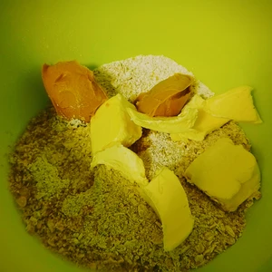
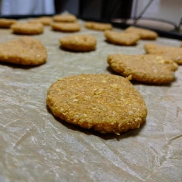

Zwar nicht so weihnachtlich, aber ganzjährig geeignet. Haferplätzchen mit Peanut-Butter Creme als Füllung. Leicht und schnell gemacht. 

<!-- more -->
# Zutaten
* 120g Haferflocken
* 100g Margarine
* 40g Erdnusscreme
* 1 EL [Hafermilch](/articles/hafermilch-2022-01-29/)
* 60g Rohrzucker
* 1pkg Vanillezucker
* 50g Dinkelmehl
* Prise Salz

Die Haferflocken müssen zermahlen werden, dies kann händisch mit einem Mörser getätigt werden oder auch mit einem Stabmixer. Zu den zermahlenen Haferflocken kommt das Dinkelmehl, Salz, Zucker, Vanillezucker hinzu. 
Zum Schluss wird die Margarine in kleinen Portionen hinzugegeben, damit diese leichter verknetet werden kann, sowie ein Esslöffel Hafermilch.

Nun wird alles zu einer Masse verknetet und kleine Kugel geformt, welche auf ein Backblech mit Backpapier gelegt und platt gedrückt werden. Je dicker die Kekse sind, umso länger brauchen diese zum Backen. Wenn diese wiederum zu dünn sind, verbrennen diese schneller.
Danach wird das Backblech für zwanzig Minuten in ein auf 200 Grad (Ober- und Unterhitze) vorgeheizten Ofen geschoben. Die Kekse härten beim Abkühlen aus, also nicht wundern, wenn diese nach zwanzig Minuten noch weich sein sollten.

