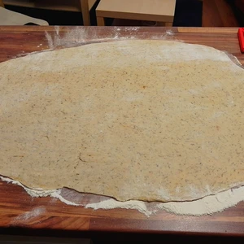
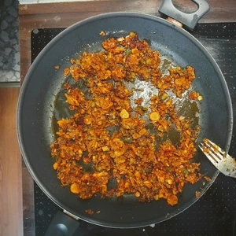
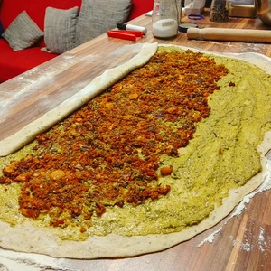
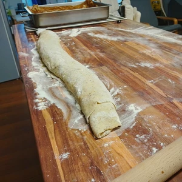
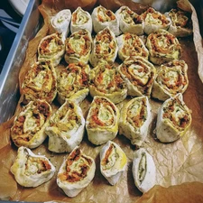
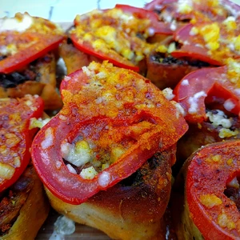

Letztens wollte ich in meinem Hackspace etwas anderes kochen, aber ein heftiges Unwetter überraschte uns und ich konnte die Zutaten nicht besorgen, also musste ich improvisieren. Daraus entstanden dann die herzhaften Pestoschnecken.

<!-- more -->

# Zutaten Teig

* 200 Gramm Dinkelmehl
* 200 Gramm Weizenmehl
* 8 Gramm Tockenhefe
* 20 Gramm Zucker
* ½ Teelöffel Salz
* 200 Mililiter Milch (Zum Beispiel [Soja Milch](/soja-milch-2023-02-04/) oder [Hafermilch](/articles/hafermilch-2022-01-29/)
* 1 Esslöffel Margarine
* 200 Gramm Pesto mit etwas Milch (Zum Beispiel [Soja Milch](/soja-milch-2023-02-04/) oder [Hafermilch](/articles/hafermilch-2022-01-29/)
* 1 Esslöffel Gewürzmischung aus: Kümmel, Salz, Pfeffer, Thymian, Rosmarin, Kurkuma, Paprikapulver, Rauchsalz

# Zutaten Hackfleisch
* 200 Gramm Hackfleisch (Zum Beispiel [Haferhack](/articles/hafer-hack-2022-09-12/) oder [Okara](/articles/okara-2023-02-04/))
* 1 Schalotte
* 1 Möhre
* 2 Knoblauchzehen
* 1 Esslöffel Tomatenmark
* 1 Schuss Sojasauce
* 1 Esslöffel [Honig](/articles/loewenzahn-sirup-2019-04-22/)

# Sonstige Zutaten
* 1 Tomate
* 1 geriebener Käse oder Feta

Für den Teig lösen wir die Hefe mit dem Zucker in der Milch auf, die Zimmertemperatur haben muss, und stellen sie beiseite, damit sie arbeiten kann.

Wir mischen das Mehl und die Gewürze, bevor wir das Salz an den Rand streuen und eine Mulde formen, in die wir die Milch mit der aufgelösten Hefe gießen. Der Teig wird grob geknetet, bevor die Margarine hinzugefügt und der Teig mindestens zehn Minuten lang geknetet wird. Danach wird der Teig mit einem feuchten Tuch abgedeckt und mindestens eine Stunde an einem warmen Ort gehen gelassen.

In dieser Zeit können wir die Karotten reiben und eine gehackte Schalotte mit Knoblauch in Öl anbraten, bis die Schalotten-Würfel glasig werden, bevor wir die geriebene Karotte hinzufügen. Das Ganze mit Honig karamellisieren lassen, dann das Tomatenmark dazugeben und mit einem kräftigen Schuss Sojasauce ablöschen. Sobald das Ganze fertig gebraten ist, kann es vom Herd genommen und beiseite gestellt werden.

||||
:----:|:----:|:----:
||

Der Teig sollte inzwischen aufgegangen sein und kann auf einer bemehlten Fläche dünn ausgerollt werden.
Versucht dabei ein Rechteck zu formen, damit beim zusammenrollen alles gleichmäßig verteilt wird.
Das Pesto vermischen wir mit einem Schuss Milch, damit es cremiger wird und sich besser auf den Teig streichen lässt. Das Hack wird in Streifen von der Mitte aus verteilt. Dann rollen wir den Teig zusammen und schneiden ihn in fünf Zentimeter breite Streifen. Diese kommen in eine mit Backpapier ausgelegte Form oder auf ein Blech, das wir mit Fett eingefettet haben. Nach Belieben Tomatenscheiben auf die Schnecken legen und mit Käse oder Feta bestreuen. 

||||
:----:|:----:|:----:
||

Die Pestoschnecken bei 180 Grad Ober- und Unterhitze ca. 25-30 Minuten backen.

|||
:----:|:----:
|
