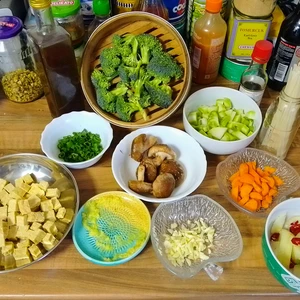
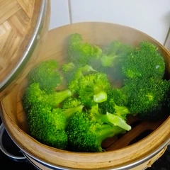
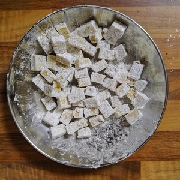
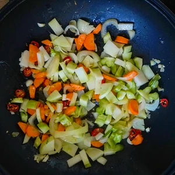
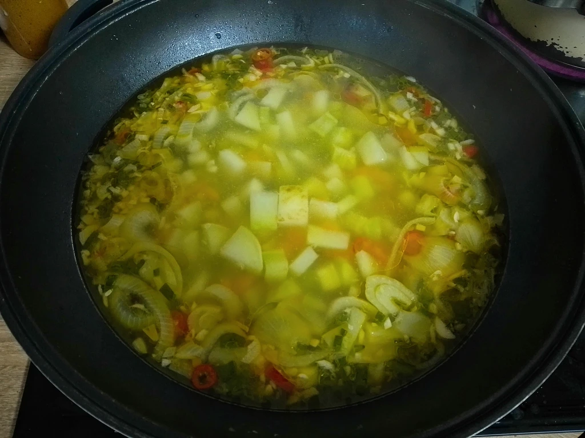
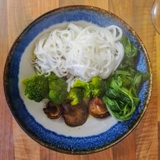
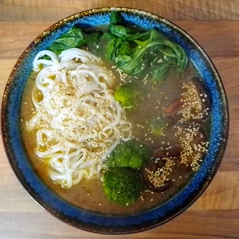

Phở ist eine traditionelle Suppe der vietnamesischen Küche, welch ich mit hiesigen Zutaten angepasst habe.

<!-- more -->

#Zuateten
* Zwei Pok Choy Blätter
* 250 Gramm Brokkoli
* 200 Gramm Tempeh oder Tofu
* Stärke
* Ein Daumen Ingwer
* Drei Knoblauchzehen
* Shitake Pilze
* Sesam
* Eine Möhre
* 1/2 Kohlrabi
* 1/4 Bund Lauch
* Reisnudeln
* [No-Fischsoße](/articles/vegane-fischsosse-2025-04-29/)
* Ein Chili
* Zwei Liter Wasser
* Etwas Zimt
* Etwas Koriander
* Vier Nelken
* Salz und Pfeffer zum Würzen

Wascht und trennt die Stängel und das Grün vom Pok Choy. Danach schneidet ihr die Stängel klein.
Den Ingwer reiben wir klein, die Chilis werden klein geschnitten, Knoblauch fein gehackt und die Zwiebel in Ringe geschnitten.
Wir trennen die Brokkoliröschen vom Stiel, schneiden den Stiel in kleine Würfel und tun dies mit dem Kohlrabi gleich.
Die Möhren werden ebenso in mundgerechte Würfel geschnitten. Der Lauch wird klein geschnitten.

Bratet den Ingwer in einer Pfanne oder Wok mit Pflanzenöl an, damit dieses Geschmack zieht und gebt dann die klein geschnittene Chili hinzu. Nach wenigen Minuten kommen Zwiebel und Knoblauch in die Pfanne.
Lasst das für etwa fünfminuten braten und gebt die Möhren hinzu. Wer will, kann nach weiteren Fünf Minuten etwas [veganen Honig](articles/loewenzahn-sirup-2019-04-22/) dazu geben und die Basis karamelisieren. Nun kann der klein geschnittene Stiel vom Brokkoli, Kohlrabi und die Pok Choy Stängel mit in die Pfanne und nach wenigen Augenblicken mit Wasser aufgefüllt werden.
Zum Schluss kommen noch vier Nelken zur Suppe.
Dies lassen wir jetzt für 45 Minuten mit Deckel darauf kochen.

|||||
:----:|:----:|:----:|:----:
|||

Währenddessen können die Brokkoliröschen in einem Bambuskorb gedämpft werden. Alternativ dürfen diese sanft kochen.

Der Tofu bzw. Tempeh wird gewürfelt und in Stärke gewälzt. Wer will, kann diese in einer Pfanne und mit Öl anbraten. **Tipp** Paprikapulver in Öl vorher kurz erhitzen, bevor das Tofu oder Tempeh hinzukommt. 
Alternativ kann diese ohne Öl auf einem Backpapier bei 180 Grad im Ofen für 30 Minuten gebacken werden.

Jetzt müssen nur noch die Reisnudeln als Beilage mit gekocht werden und der Sesam in einer Pfanne ohne Öl geröstet werden.

Zur Suppe geben wir nun etwas [No-Fischsoße](articles/vegane-fischsosse-2025-04-29/), Zimt, Koriander, Salz und Pfeffer hinzu und trennen das Gemüse von der Brühe.

Die Shitake Pilze braten wir noch scharf an und dann können wir schon in einem tiefen Teller, die Nudeln, Pok Choy Blätter, Brokkoli, die Shitake Pilze arrangieren.
Nu kann die Brühe hinzugegeben werden und das Sesam über unser Phở gestreut werden.

Wer will, kann auch etwas Sriracha dazu mischen.

  
