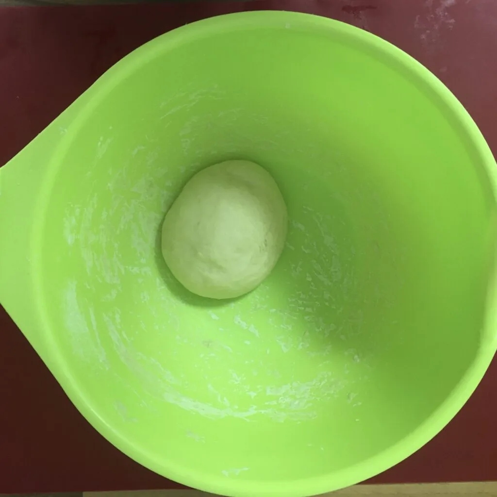
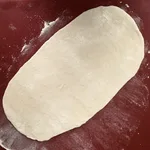
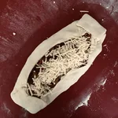

Da ich schon mal das Rezept für das Hafer-Hack niedergeschrieben habe, kann ich auch jenes für die Pide verewigen. Worum geht es? Pide ist ein Hefeteig gefüllt mit Hack. In meinen Fall zusätzlich mit Käse überbacken und mit Paprikasorten ausgebessert.

## Zutaten

* 100g Weizenmehl Typ 405
* 100ml lauwarmes Wasser
* 3g Trockenhefe
* Prise Zucker
* Prise Salz
* Hack (zum Beispiel Hafer-Hack)
* veganer Käse
* Paprika, Chilis, Jalapeños oder Tomaten

Das Hack könnt ihr bereits vorbereiten und nach eigenem Geschmack anbraten. Solltet ihr fertiges Hack nehmen, empfehle ich während des Anbraten je ein Teelöffel Honig, Tomatenmark und Sojasoße unterzumischen, damit ein leichter BBQ Geschmack entsteht.

Währenddessen gebt ihr die Hefe und Zucker in das Wasser, alternativ geht auch Milch, verrührt das ganze, bis es keine Klümpchen mehr gibt. Das Salz und Mehl wird vermengt und das Wasser hinzugegeben. Nun wird der Teig geknetet und gezogen, bis dieser nicht mehr klebt. Zieht am besten die Enden lang, überlappt diese und wiederholt dies einige male. Danach lässt ihr den Teig für mindestens 10 Minuten ruhen. Das Hack sollte währenddessen fertig sein.

|||
:----:|:----:
|

Der Teig wird nun auf einer bemehlten Oberfläche dick und lang ausgerollt, sowie mit dem Hack belegt. Hierzu kann man die Pide noch Paprika, Chilis, Jalapeños oder Tomaten belegen. Streut den veganen Käse darüber und klappt die Ränder über das Hack, dass ein Schiffchen entsteht.

Die Pide kommt bei 220 Grad Ober/Unterhitze in einen vorgeheizten Ofen. Die Ränder können mit etwas Oliven Öl bestrichen werden, damit der Teig knusprig wird und eine schöne Farbe erhält. Fertig ist die Pide nach ca. 20-30 Minuten oder wenn der Teig eine schöne braune Farbe erhält.

||||
:----:|:----:|:----:
||
