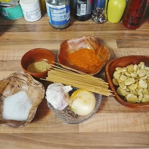

Bei diesem ungarisch inspirierten Gericht handelt es sich um ein schnelle und einfache Pilzpfanne in Paprikasauce. Dabei sind die Spaghetti optional, da das Gericht auch mit Kartoffeln oder Reis zubereitet werden kann.

<!-- more -->

# Zutaten 
* 3 TL Paprikapulver
* Salz
* Pfeffer
* 1 Zwiebel
* 200 Gramm Pilze (nach Wahl)
* 1 EL Joghurt (oder [Kochcreme](/articles/kochcreme-aus-hafermilchproduktion-2022-04-09/))
* Nudeln, Kartoffeln oder Reis
* 4 Knoblauchzehen
* 1 Schöpfkelle Gemüsebrühe
* Margarine
* Gehackte Kräuter (zum Beispiel Petersilie)

Die Zwiebel und den Knoblauch hacken wir in kleine, feine Würfel und braten diese in reichlich Margarine an. Parallel dazu kochen wir etwas [Gemüsebrühe](/articles/gemusebruhe-2024-01-28/) auf, um damit das Gemüse und die Pilze zu löschen. Auch bereiten wir schon das Wasser für die Spaghetti vor. Alternativ können wir auch Kartoffelwürfel kochen oder Reis.

Sobald die Zwiebel Farbe bekommen haben, geben wir die Pilze hinzu. Dabei ist es egal, welch Pilze wir hierzu benutzen. Champignons sind recht neutral, Steinpilze oder Pfifferlinge sind ebenso eine Option, falls ihr im Wald Parasolpilze findet, nutzt auch gerne diese.
Die Pilze lassen wir kurz in der Margarine mit dem Zwiebeln anbraten und streuen dann Salz und Paprikapulver darüber. Das Ganze wird nun kurz in der Pfanne gebraten, bevor wir ein Schöpflöffel der aufgekochten Gemüsebrühe darüber gießen 

Zusätzlich geben wir noch fein gehackte Kräuter hinzu und lassen alles etwas in der Pfanne etwas köcheln, bevor wir den Klecks Joghurt hinzugeben. Verrührt alles, würzt gegebenenfalls mit Salz und Pfeffer nach und schon kann es mit den Nudeln (oder Kartoffel bzw. Reis) serviert werden.
  
