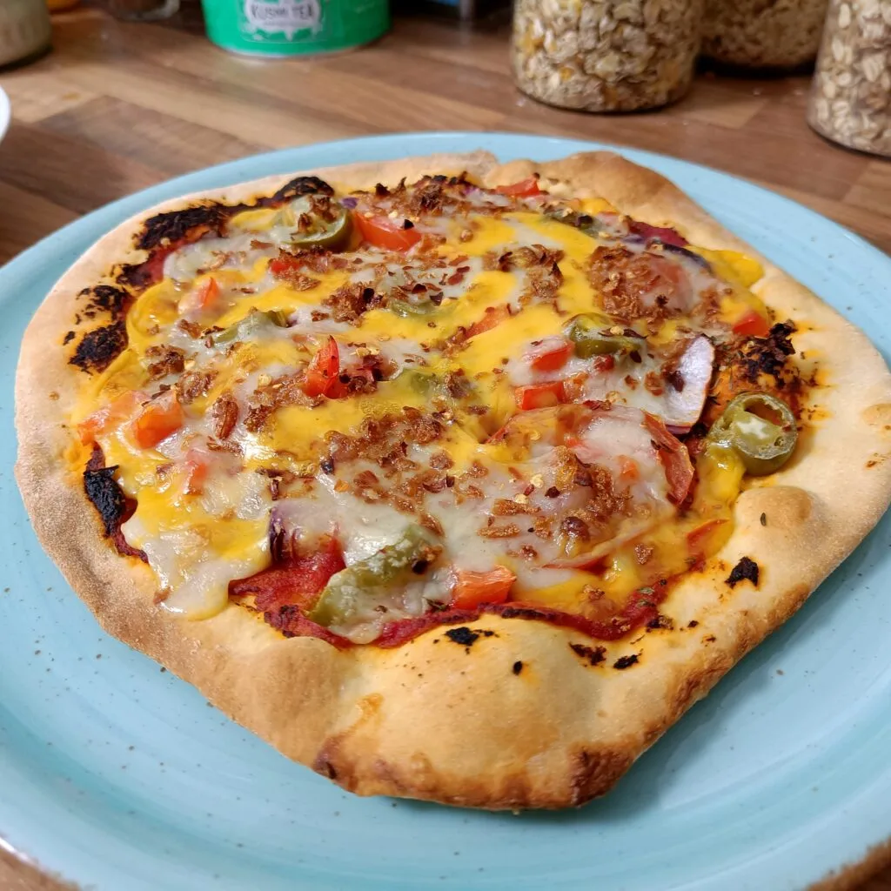
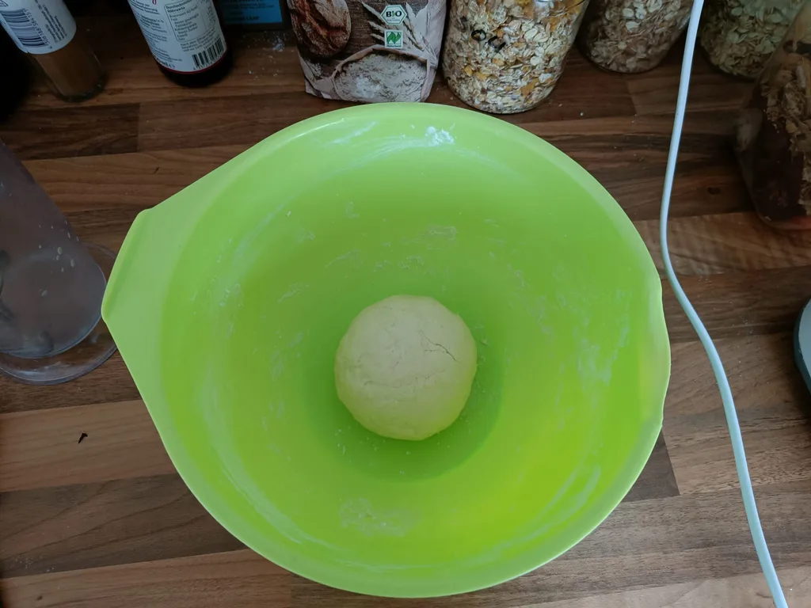
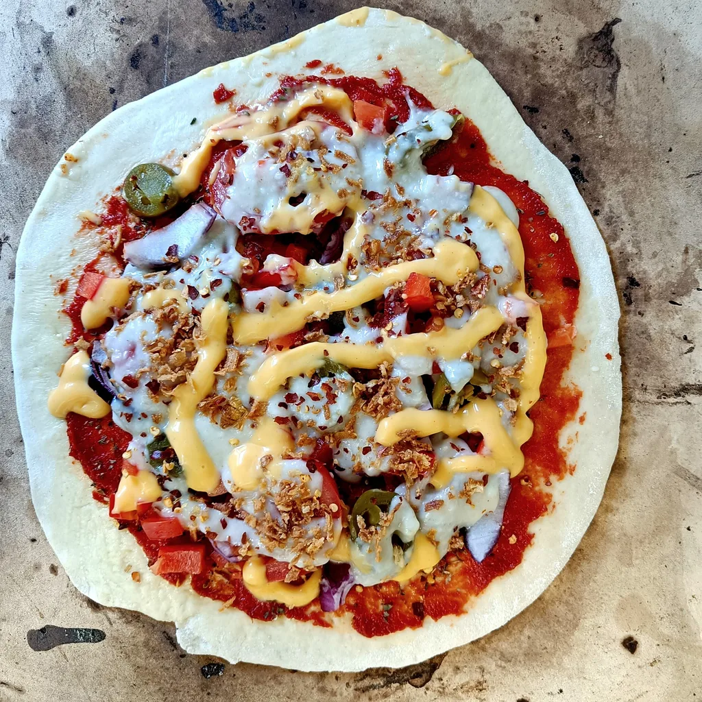

Irgendwie habe ich hier noch nie was zum Thema Pizza geschrieben, weshalb ich das Flott nachhole. Den Pizzaboden kann man simpel selber machen und der Aufwand hierzu ist sehr gering. Man benötigt ebenso auch nur wenige Grundzutaten und den gewünschten Belag.

## Zutaten Pittzateig

- 200g Mehl Typ 550
- 100ml lauwarmes Wasser
- 1/2 Packung Trockenhefe
- 1 TL Zucker
- 1 TL Salz
- 2 EL Olivenöl
- 1 Knoblauchzehe

Die Hefe löst ihr zusammen mit dem Zucker im lauwarmen Wasser auf und stellt dies erstmal zur Seite. Zum Mehl wird das Salz hinzugefügt und eine Knoblauchzehe ausgedrückt, sowie das Olivenöl hinzugegeben. Gießt nun zum Mehl die im Wasser aufgelöste Hefe hinzu. Der Teig wird daraufhin solange geknetet und gezogen, bis dieser nicht mehr klebt, eine glatte Oberfläche hat und beim Drücken nicht zu fest anfühlt. Danach kann der Teig für zwei Stunden an einem warmen Ort gehen.

## Zutaten Tomatensoße

- 2 EL Tomatenmark
- 1 EL Olivenöl
- 1 Knoblauchzehe
- Thymian
- Oregano
- Basilikum
- Prise Salz

Tomatenmark, Gewürze mit Olivenöl und einer ausgepressten Knoblauchzehe verrühren und ziehen lassen, solange der Pizzateig geht.

Auf einer bemehlten Oberfläche kann nun der Teig ausgerollt werden. Die dicke kann nach Belieben variieren, da die Pizza durch die Dicke entweder luftig und der Durchmesser kleiner wird oder entsprecht größer und mit einem knusprigen Boden. Ich bestreiche die Oberfläche der Pizza noch immer mit etwas Olivenöl, bevor ich die Tomatensoße darauf verteile. Falls die Soße zu dick sein sollte, kann man diese mit einem Esslöffel Wasser verdünnen. Danach kann die Pizza nach Belieben belegt werden.

In meinem Beispiel wurde die Pizza mit Tomaten, Paprika, Zwiebel, Jalapeños und Röstzwiebel belegt, darüber kamen zwei Käsesoßen. Die Pizza kommt für 15–20 Minuten in einen Ofen, welcher auf 220 Grad Ober- und Unterhitze vorgeheizt wurde.

Falls ihr einen Pizza-Stein benutzen wollt, heizt den Stein im Ofen auf 275–300 Grad vor. Legt die belegte Pizza darauf und backt diese, bis der Boden unten knusprig wird. Falls eine Grillfunktion vorhanden ist, tröpfelt ihr etwas Öl auf die Pizza, stellt die oberste Schiene und grillt diese für eine Minute. **Achtung!** Falls man nicht aufpasst, hat man schnell eine Scheibe Kohle.
