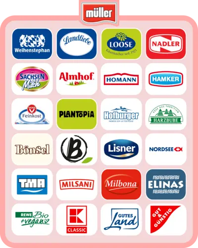

Nichts kann eins mehr gut finden, weil andauernd Kapitalisten, Ausbeuter, Rechtsextreme und deren Sympathisanten alles kaufen, übernehmen und kaputt machen müssen. Deshalb können wir nichts Schönes haben.

Der Kauf von Berief durch Müller, nahm ich zum Anlass über die Verbindungen von Müller zu informieren, niederzuschreiben und bei Möglichkeit zu pflegen. 
Theo Müller, welcher nicht nur mit der AfD sympathisiert, sondern auch Rechtsextremismus und Hass Salonfähig macht.

Zwar hat Theo Müller versucht unter anderem Campact zu verbieten, dies zu kommunizieren, wurde aber Campact wurde vom Gericht bestätigt.
[Quelle](https://www.campact.de/presse/mitteilung/20260224-pm-mueller_gericht/)

Aber es geht nicht in erster Linie darum ob Müller nun mit der AfD sympathisiert, die Rechtengedanken sitzen dort tief. Es geht um die Verbindung der Produkte, Marken und Namen.

Wer vegan lebt, war nicht direkt betroffen, da die industrielle Milchproduktion durch Zwangshaltung von Kühen ja eh nicht unterstützt wird. Aber Berief stellte auf Basis von Hafer und Soja, auch für DM und Rossmann vegane Produkte her.

# Wo steckt nun überall Müller drin?

## Logistik
* [Culina Logistics GmbH](https://www.culinalogistics.de/)
* [Eddie Stobart Group Limited](https://eddiestobart.com/)
* Emhage Transportgesellschaft GmbH

## Sonstiges
* [Fahrzeugtechnik Aretsried GmbH](https://www.fta-gmbh.de/) Fahrzeugtechnik
* [Optipack GmbH](https://www.optipack.de/) Verpackung 

## Lebensmittel
* [Heinrich Hamker Lebensmittelwerke](https://www.homann.de/)
* [Homann Feinkost](https://www.homann.de)
* [Harzbube](https://www.harzbube.de/)
* Pragolaktos (Tschechien und Slowakai)
* [Käserei Loose GmbH & Co. KG](https://www.kaeserei-loose.de/)
* [Landliebe Molkereiprodukte GmbH](https://www.landliebe.de/)
* [Lisner Holding sp. z o.o.](https://www.lisner.pl/) Polen
* [Molkerei Weihenstephan GmbH & Co. KG](https://www.molkerei-weihenstephan.de/)
* [Nadler Feinkost GmbH](https://www.nadler.de/)
* [Plantopia GmbH](https://openregister.de/company/DE-HRB-D2102-37627) 
* [Sachsenmilch Leppersdorf GmbH](https://www.sachsenmilch.de/)
  * Lidl
    * Milbona - Gouda
* [Weinstephan](https://www.muellergroup.com/karriere/unsere-marken/weihenstephan)
* [T.M.A Handelsgesellschaft mbH aus Leppersdorf](https://www.tma-milk.com/) Referenzieren auf:
  * Aldi Nord
    * Milsani
  * Aldi Süd
  * Edeka
    * Gut und Günstig (Buttermilch)
  * Norma
  * Kaufland 
    * K Classic (Sahne-Milchreis)
  * Lidl
    * Milbona - Joghurts
    * Milbona - Buttermilch
  * Penny
  * Netto 
    * Gutes Land
  * Rewe
* Voss Feinkost und Lebensmittel GmbH. Referenzieren auf:
  * Almare Seafood
  * Wonnemeyer
  * Trader Joe's
  * Chef Select
  * BBQ Zeit zum Grillen
  * Be Light
  * Ofterdinger
  * Delikato (Aldi)
  * Gourmet (Aldi)
  * Kim (Aldi)
  * Espana
  * Pasta Genuss 
  * Nordholmer (Aldi)
  * Freihofer Gourmet
  * Mein Veggie Tag (Aldi)
  * Meierkamp
  * Gourmet Finest Cuisine (Aldi)
  * Food For Future (Penny)
* [WSF Fischfeinkost GmbH](https://www.wsf-fischfeinkost.de/)
* [Berief GmbH](https://www.berief-food.de/)
* Soja Food GmbH. Referenzen auf:
  * REWE
    * REWE Bio + Vegan, Reis Drink Natur
    * REWE Bio Pflanzlich, Hafer Drink mit deutschen Bio-Hafer
    * REWE Bio Pflanzlich, Soja Drink mit Bio-Soja aus der EU
    * REWE Bio + Vegan, Soja (Joghurt) Natur auf Basis von Bio-Soja
  * Aldi (Eigenmarken)
  * Kaufland (K-Classic Tofu)
  * dm (dmBio)
  * Rossmann (EnerBio)
* [Bönsel](https://www.boensel-kochkaese.de/)
* [Nordsee](https://www.nordsee.com/de/)
* Almhof 
* Gut und Günstig (Edeka)
* Ja! (Rewe)
* Hofburger (Aldi)

# Folgende Eigenmarken sind nicht von Müller
* REWE
  * REWE Bio Pflanzlich Kokos (Joghurt) Natur 
    * Elsdorfer Molkerei und Feinkost GmbH
  * REWE Pflanzlich Soja (Joghurt) Vanille Geschmeck
    * Elsdorfer Molkerei und Feinkost GmbH
  * Rewe Pflanzlich Soja Natur
    * Elsdorfer Molkerei und Feinkost GmbH
  * REWE Bio +Vegan Hafercreme Cuisine
    * MONA Naturprouke GmbH
  * REWE Bio +Vegan Sojacreme Cusine
    * MONA Naturprouke GmbH
  * REWE Bio +Vegan No Muhh Drink
    * MONA Naturprouke GmbH
  * REWE Pflanzlich Barista Hafer Zero ohne Zucker
    * MONA Naturprouke GmbH

* Lidl
  * Vermondo Chili Sin Carne
    * SGS Geniesser Service GmbH & Co. KG
  * Vermondo Spätzle
    * Bürger GmbH & Co. KG
  * Vermondo Falafel
    * Fine-Food-Kontor GmbH
  * Vermondo High Protein Sojadrink
    * [Frías nutrición, España](https://frias.es/)
  * Vermondo High Protein Schokodrink
    * [Frías nutrición, España](https://frias.es/)
  * Vermondo Haferdrink 3.5%
    * [Grønvang Food ApS, Denmark](https://gronvang.dk/)
  * Vermono Barista Haferdrink 
    * [Grønvang Food ApS, Denmark](https://gronvang.dk/)
  * Vermondo Bio Haferdrink
    * [The Oat Factory GmbH](https://theoatfactory.com/)
  * Vermondo Bio Schoko Haferdrink
    * [Grønvang Food ApS, Denmark](https://gronvang.dk/)
  * Vermondo Bio Mandeldrink 
    * [Grønvang Food ApS, Denmark](https://gronvang.dk/)
  * Vermondo Kokos Joghurt
    * [PlantA GmbH](https://planta.as/)
  * Vermondo Veganer Sojajoghurt
    * N+G Frischprodukten Vertriebs-GmbH - [Bauer Gruppe](https://www.bauer-gruppe.de)
    * [Elsdorfer Molkerei und Feinkost GmbH](https://elsdorfer.de/) - [Bauer Gruppe](https://www.bauer-gruppe.de)
  * Vermondo Vegane Scheibe
    * Jerg GmbH & Co. KG
