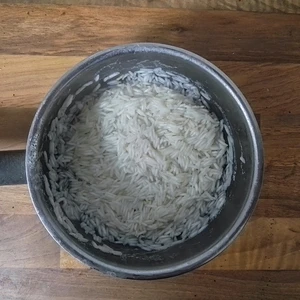
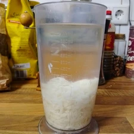
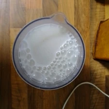
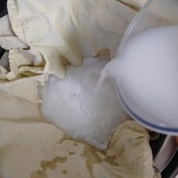

Durch das Schauen einer Reportage über einen Reisbauer aus Japan, bin ich auf die Idee gekommen ein Reisdrink, als Milchersatz zu erstellen. 
Die Umsetzung ist sehr simpel und das Nebenprodukt ist ebenso sehr schmackhaft.

<!-- more -->

# Zutaten
* 100ml Basmatireis
* 200ml Wasser zum Kochen
* 700ml Wasser für den Drink
* Prise Salz
* Zucker

Wir kochen zuerst den Basmatireis mit 200ml Wasser, in welches wir Zucker und Salz hinzufügen. Sobald das Wasser verkocht wurde, kippen wir den Reis in einen Behälter, in dem wir dieses pürieren können. Hinzu kommen 700ml Wasser. 
Wasser und dem pürierten Reis filtern wir durch einen Nussbeutel und pressen jegliche Flüssigkeit heraus.
Damit ist der Reisdrink bereits fertig. Den restlichen Reis, welcher im Beutel zu einer Masse gedrückt wurde, kann jetzt mit [Honig](/articles/loewenzahn-sirup-2019-04-22/) und Zimt zu einem köstlichen süßen Nachtisch verarbeitet werden.

|||||
:----:|:----:|:----:|:----:
|||
